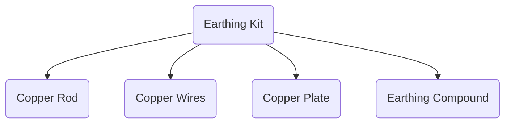
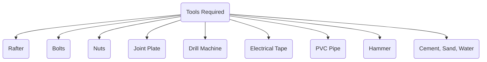
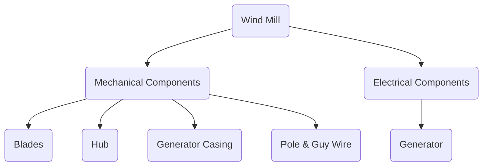
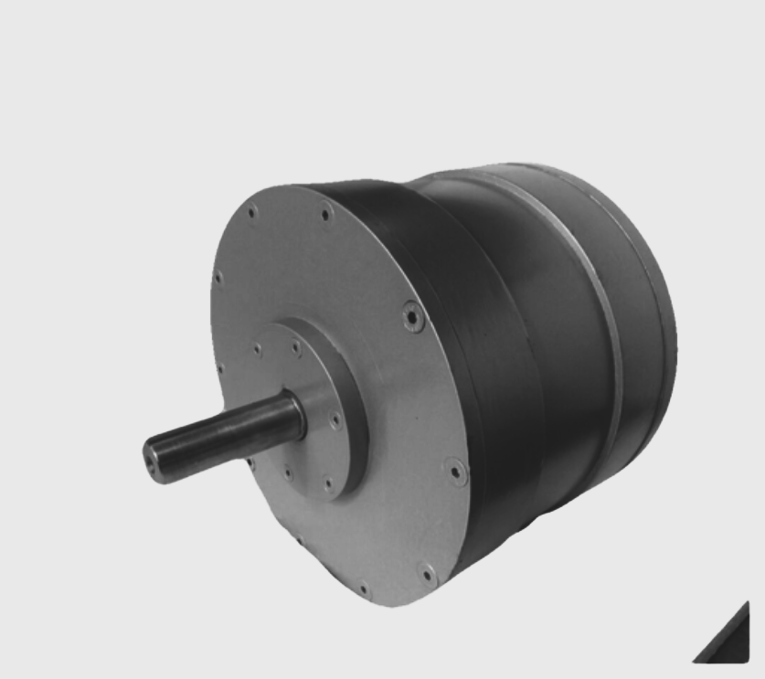
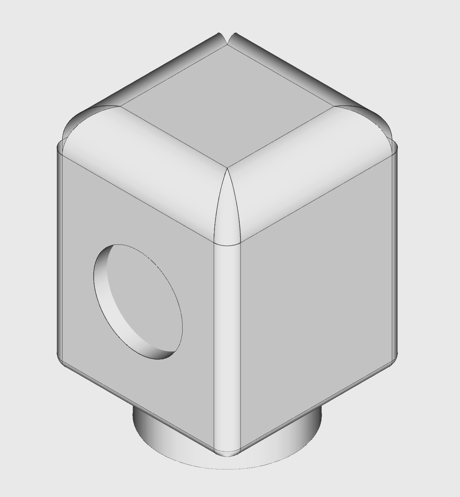
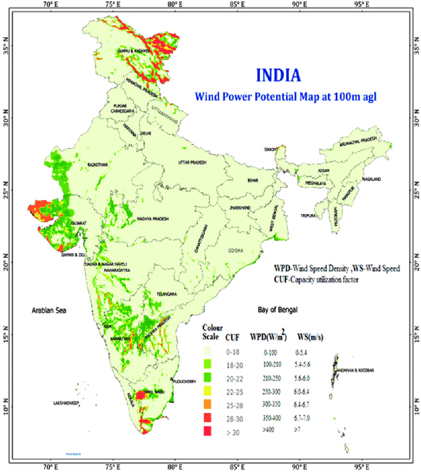

# ELP305, Design and Systems Lab

>Semester 2, 2021-22
>
>Week 3 Design for Sunergy Assignment
>
>Author: **Tribe D (DukhDard)**
>
>Submitted to: Prof. Subrat Kar, Instructor, ELP305 Design and Systems Lab

# Table of Contents

- [ELP305, Design and Systems Lab](#elp305-design-and-systems-lab)
- [Table of Contents](#table-of-contents)
- [1. Our Tribe](#1-our-tribe)
- [2. Readability Indices](#2-readability-indices)
  - [2.1 Documentation Statistics](#21-documentation-statistics)
  - [2.2 Document Readability indices](#22-document-readability-indices)
- [3. Preamble](#3-preamble)
  - [3.1 Abbreviations](#31-abbreviations)
  - [3.2 List of Tables](#32-list-of-tables)
  - [3.3 List of Figures](#33-list-of-figures)
  - [3.4 Units used](#34-units-used)
  - [3.5 Gantt Chart](#35-gantt-chart)
- [4. Motivation](#4-motivation)
- [5. Abstract](#5-abstract)
- [6. House Design](#6-house-design)
- [7. Solar Energy](#7-solar-energy)
    - [7.1. Solar panels panels](#71-solar-panels-panels)
    - [7.2. Off Grid Solar Inverter](#72-off-grid-solar-inverter)
    - [7.3. Batteries](#73-batteries)
    - [7.4. Wires (AC and DC)](#74-wires-ac-and-dc)
    - [7.5. ACDB (1 in 1 out)](#75-acdb-1-in-1-out)
    - [7.6. DCDB (1 in 1 out)](#76-dcdb-1-in-1-out)
    - [7.7. Solar water Heater](#77-solar-water-heater)
      - [7.7.1 Price reference](#771-price-reference)
    - [7.8 Charge Controller](#78-charge-controller)
    - [7.9. Clamp metre](#79-clamp-metre)
    - [7.10. MC4 connector](#710-mc4-connector)
    - [7.11. Solar Panel Stand](#711-solar-panel-stand)
    - [7.12. Earthing Kit](#712-earthing-kit)
    - [7.13. Lighting Arrester](#713-lighting-arrester)
    - [7.14. Basic tools required](#714-basic-tools-required)
- [8. Wind Energy](#8-wind-energy)
  - [8.1. Components of Wind Mill](#81-components-of-wind-mill)
  - [8.2. Component Description](#82-component-description)
    - [8.2.1. Blade](#821-blade)
    - [8.2.2. Pole + Guy Wires](#822-pole--guy-wires)
    - [8.2.3. Hub](#823-hub)
    - [8.2.4. Turbine/generator](#824-turbinegenerator)
    - [8.2.5. Casing](#825-casing)
    - [8.2.6. Assembly](#826-assembly)
  - [8.3. Cost Analysis](#83-cost-analysis)
  - [8.4. Power Analysis](#84-power-analysis)
- [9. Biomass Energy](#9-biomass-energy)
- [10. Storage](#10-storage)
  - [10.1. Requirements](#101-requirements)
  - [10.2. Specifications](#102-specifications)
  - [10.3. Design](#103-design)
    - [10.3.1 Charge Controller](#1031-charge-controller)
    - [10.3.2 Battery](#1032-battery)
    - [10.3.3 Inverter (For converting DC to AC)](#1033-inverter-for-converting-dc-to-ac)
      - [Design of a simple inverter:-](#design-of-a-simple-inverter-)
  - [Cost Analysis](#cost-analysis)
- [11. Closure](#11-closure)
- [12. Reuse](#12-reuse)
- [13.  Appendix](#13--appendix)
  - [13.1. Wind energy density distribution over India](#131-wind-energy-density-distribution-over-india)
  - [13.2. Power Calculations](#132-power-calculations)
- [14. References](#14-references)
  

# 1. Our Tribe

| S. No. | Name                     | Entry No.   | Role                                      | Performance (on the scale of 1) |
| ------ | ------------------------ | ----------- | ----------------------------------------- | ------------------------------- |
| 1      | Vibhu Goyal              | 2019MT10732 | Tribe Coordinator                         | 1                               |
| 2      | Abhinav Kumar            | 2019EE10945 | Solar Energy Tribe Sub Coordinator        | 1                               |
| 3      | Sanidhia Maheshwari      | 2019MT10762 | Wind Energy Tribe Sub Coordinator         | 1                               |
| 4      | Saksham Sodani           | 2019MT10724 | Biomass Energy Tribe Sub Coordinator      | 1                               |
| 5      | Bhavya Yadav             | 2019MT10684 | Documentation Tribe Sub Coordinator       | 1                               |
| 6      | Surya Sachan             | 2019EE30603 | Storage and Battery Tribe Sub Coordinator | 1                               |
| 7      | Ojaswa Anand             | 2019MT10709 | Design Tribe Sub Coordinator              | 1                               |
| 8      | Rishav Raj               | 2019MT10652 | Supervisor                                | 1                               |
| 9      | Aranya Sen               | 2019MT60746 | Member                                    | 1                               |
| 10     | Ayush Singh              | 2019MT60748 | Member                                    | 1                               |
| 11     | Ayush Goyal              | 2019MT10961 | Member                                    | 1                               |
| 12     | Abhishek Narayan Singh   | 2019MT10669 | Member                                    | 1                               |
| 13     | Bhavik Goyal             | 2019EE30563 | Member                                    | 1                               |
| 14     | Sunny Kumar              | 2019EE10534 | Member                                    | 1                               |
| 15     | Shalini                  | 2019EE30599 | Member                                    | 1                               |
| 16     | Sarthak Shrivastava      | 2019MT10725 | Member                                    | 1                               |
| 17     | Lagishetti Vijay Maruthi | 2019MT10262 | Member                                    | 1                               |
| 18     | Gagandeep                | 2019MT10691 | Member                                    | 1                               |
| 19     | Rahul kadam              | 2019EE10987 | Member                                    | 1                               |
| 20     | Abhilasha Choudhary      | 2019EE10454 | Member                                    | 1                               |
| 21     | Mitali Malav             | 2019MT10704 | Member                                    | 1                               |
| 22     | Gaddam Praneel Jefferson | 2019EE10476 | Member                                    | 1                               |
| 23     | Sajal Tyagi              | 2019MT60761 | Member                                    | 1                               |
| 24     | Vatsal Singhal           | 2019EE10544 | Member                                    | 1                               |
| 25     | Himanshu Meena           | 2019EE30573 | Member                                    | 1                               |
| 26     | Satvik Shubham Singh     | 2019EE30598 | Member                                    | 1                               |
| 27     | Ishan Digra              | 2019EE10485 | Member                                    | 1                               |
| 28     | Sachin Tyagi             | 2019EE10514 | Member                                    | 1                               |
| 29     | Ishan Jawale             | 2019EE30797 | Member                                    | 1                               |
| 30     | Sonu Besra               | 2019MT10729 | Member                                    | 1                               |
| 31     | Mahesh Nimbal            | 2019EE10899 | Member                                    | 1                               |
| 32     | Jaskeerat Singh Saluja   | 2019MT60752 | Member                                    | 1                               |
| 33     | Ayush Chaudhary          | 2019EE10473 | Member                                    | 1                               |
| 34     | Ishaan Singhal           | 2019EE10899 | Member                                    | 1                               |
| 35     | Rohan Mahala             | 2019MT60760 | Member                                    | 1                               |
| 36     | Raunak Jain              | 2019MT10719 | Member                                    | 1                               |
| 37     | Pragna Varshini          | 2019EE30569 | Member                                    | 1                               |
| 38     | Rithwik Parikipandla     | 2019MT10720 | Member                                    | 1                               |
| 39     | Manish Borthakur         | 2019MT60493 | Member                                    | 1                               |
| 40     | Prakash Khandelwal       | 2019EE10505 | Member                                    | 1                               |
| 41     | Dyuti Bhardwaj           | 2019EE10475 | Member                                    | 1                               |
| 42     | Aditi Jain               | 2019MT60839 | Member                                    | 1                               |
| 43     | Pranav Chawla            | 2019MT60757 | Member                                    | 1                               |
| 44     | Navya Arora              | 2019MT10707 | Member                                    | 1                               |
| 45     | Vikash Kulhari           | 2019MT10733 | Member                                    | 1                               |
| 46     | Pradyumn Singh Rahar     | 2019EE30588 | Member                                    | 1                               |
| 47     | Arpit                    | 2019EE30558 | Member                                    | 1                               |
| 48     | Sparsh Chaudhri          | 2019MT10765 | Member                                    | 1                               |
| 49     | Valaya Ramchandni        | 2019MT10731 | Member                                    | 1                               |
| 50     | Ritik Yadav              | 2019MT10759 | Member                                    | 1                               |
| 51     | K Dinesh Reddy           | 2019EE10489 | Member                                    | 1                               |

- This document was submitted on 2 Feb, 2022.
- The person to contact for any clarification: Bhavya Yadav (Documentation Tribe Sub Coordinator, mt1190684@iitd.ac.in )

# 2. Readability Indices

## 2.1 Documentation Statistics

| Quantity                             | Count |
| ------------------------------------ | ----- |
| Word count                           | 1801  |
| Total number of complex words        | 288   |
| Average number of words per sentence | 3.46  |
| Total number of sentences            | 521   |
| Average number of syllable per word  | 1.65  |

## 2.2 Document Readability indices

| Indice                      | Value | Meaning |
| --------------------------- | ----- | ------- |
| Flesch Kincaid Reading Ease | 63.8  |
| Flesch Kincaid Grade Level  | 5.2   |
| Gunning Fog Score           | 4.6   |
| SMOG Index                  | 4.6   |
| Coleman Liau Index          | 9.9   |
| Automated Readability Index | 0.9   |

# 3. Preamble

## 3.1 Abbreviations

| Abbreviation | Definition |
| ------------ | ---------- |

## 3.2 List of Tables

| Table Number | Information |
| ------------ | ----------- |

## 3.3 List of Figures

| Figure Number | Information |
| ------------- | ----------- |

## 3.4 Units used

## 3.5 Gantt Chart

Attached at the end of the pdf report.

# 4. Motivation

>We are designing a system to meet the entire energy needs of your home without drawing commercial electrical power from the utility. This report contains the final report of the house designed by Tribe D i.e. the requirements, specifications and design of the house.

# 5. Abstract

# 6. House Design

# 7. Solar Energy

The average Global tilted irradiation id 5.494 kWh/m$^2$ per day.
The average sunlight time is 5.494 hour per day, with an error factor of 1.1 avg sunlight i.e. 4.99 hours.

### 7.1. Solar panels panels

Solar Panels should produce approx 6-8 kWh per day. It is the primary component for the solar energy system used to convert sunlight into electricity. Solar panels should fulfill the requirements :

1. They should have auto-clean covering for better sunlight incident on solar cells.
2. They should be sturdy
3. They Should not degrade by constant heating and cooling down
4. They should be uv protected

We are using six 335W Solar panels (Total 335W * 6 =2.01 kW). The following are the specifications of the Solar Panels used:

| Property                    | Specification               |
| --------------------------- | --------------------------- |
| Manufacturer                | Luminous (335W/24V)         |
| Material                    | monocrystalline solar panel |
| Number of panels            | 6                           |
| Operating Voltage           | 24 V                        |
| Dimensions                  | height - 6.4 feet           |
|                             | width - 3.2 feet            |
| Short Circuit current       | 10.57 A                     |
| Current at Max Power (imax) | 10.03A                      |
| Open Circuit voltage        | 46.5 V                      |
| One Panel weight            | 22Kg                        |
| One Panel price             | Rs 14,500(approx)           |
| Area for solar panels       | 180 sq.feet                 |

Features of Luminous Monocrystalline Perc solar Panels are:

1. Excellent performance under low light conditions.
2. Comes with highly qualified anti-reflective glass.
3. Comes with latest PERC(Passivated Emitter and Real Cell) technology.
4. Panels made of potential-induced degradation (PID) resistance technology.
5. Comes with premium MC4 connectors along with 1000mm DC cable that ensures a secure and safe connection.
6. These Solar Panels offer high torsion resistance against wind  and snow loads due to its silver anodized aluminium frame.

### 7.2. Off Grid Solar Inverter

It is the central component that converts DC Voltage into AC for AC operated home appliances. Solar inverter should fulfill the requirements :

- It should have an overload warning mechanism.
- It should have overload and short circuit protection.
- It should have at least 2.5kW power rating.
- It should be able to withstand high temperatures and should have  good cooling mechanism.
- It should be resistant to humid climate.

We are using a solar inverter with the following specifications:

| Property                | Specification            |
| ----------------------- | ------------------------ |
| Input Voltage           | 24V                      |
| Output Voltage          | 230V AC 50Hz             |
| Continuous Output Power | 5kW                      |
| Surge Output Power      | 10-12kW                  |
| Output Waveform         | Pure Sine Wave generator |
| Efficiency              | 90-95%                   |

[Cost-Reference]((https://www.luminousindia.com/solar-products/solar-pv-panel.html#:~:text=Monocrystalline%20PERC%20solar%20efficient%20as%20compared%20to,from%20as%20per%20your%20%20preference))

It has over voltage protection, low voltage protection, overload protection, short circuit protection and over Temperature Protection.

### 7.3. Batteries

Battery should be completely safe, not burnable, stable and maintenance-free. Battery should fulfill the requirements :

1. It should have good electrical performance with low resistance.
2. It should have a high number of charge cycles.
3. It should have a high current rating.

### 7.4. Wires (AC and DC)

The wires that are used in the connection of panels with the Solar inverter are called DC wires. These wires should be in PVC pipe and cable tray for protection from DC current and Sunlight.  

The specifications of DC Wire are as follows:

| Property                                       | Specification                    |
| ---------------------------------------------- | -------------------------------- |
| Solar Array to DCDB                            |                                  |
| Wire Gauge                                     | 12AWG                            |
| Diameter                                       | 1.8493mm                         |
| One way distance                               | 6m                               |
| DCDB to  Charge Controllers                    |                                  |
| Wire Gauge                                     | 12AWG                            |
| Diameter                                       | 1.8493mm                         |
| One way distance                               | 6m                               |
| Charge Controller to Batteries                 |                                  |
| Wire Gauge                                     | 6AWG                             |
| Diameter                                       | 4.09mm                           |
| One way distance                               | 2m                               |
| Earthing Wire                                  |                                  |
| For circuit grounding (Grounding 1 in Drawing) | 6 AWG                            |
| For Lightning Arrestor                         | 50sq mm Aluminum Wire(insulated) |

[Wire Size Calculator](https://www.omnicalculator.com/physics/wire-size)

[Solar panel grounding wire size guide](https://www.portablesolarexpert.com/solar-panel-grounding-wire-size-guide/)

The wires that are used for the connection of the inverter with the grid power and Household loads are called AC wires (6mm inverter to household loads).

### 7.5. ACDB (1 in 1 out)

It includes AC SPD, AC fuse and MCB to protect the solar inverter from high voltages on the AC current side. ACDB should fulfill the requirements:

1. It should have capacity upto 3kW.
2. Dust and water protected
3. Polycarbonate Material
4. MCB Based AC disconnection
5. It should have current rating
6. It should have high voltage and frequency ass in AC

### 7.6. DCDB (1 in 1 out)

It protects the solar energy system from DC current from panels and protects panels from reverse current flow. DCDB should fulfill the requirements:

1. It should include DC Fuse, DC MCB and SPDs.
2. With an LED indicator for the Current produced from the panels
3. IP66 Polycarbonate Material
4. With DC SPD,DC Fuse and Indicators
5. It should have fuse with dc rated  current rating
6. It should have voltage rating as of o/p of solar panels

The following table shows the specifications of the DCDB used:

| Property          | Specification           |
| ----------------- | ----------------------- |
| Maximum current   | 3*10.57A* 1.25 = 39.63A |
| Fuse Rating       | 38-40A                  |
| Brand             | Havells                 |
| Model Name/Number | zoob                    |
| Voltage           | 220-240 V               |
| Material          | PVC IP68                |
| Power rating      | 1-3kW                   |

### 7.7. Solar water Heater

A Solar water heater with the following requirements:

1. Medium Installation area should be required
2. Solar Collector with copper tubes for better conduction
3. It should have good efficiency
4. Should not get overheated and cause damage
5. Some covering on the sides must be incorporated to prevent burn if someone comes nearby
6. Insulated hot water storage tank approx
7. Cold water tank with required insulated hot water pipelines and accessories.
8. Pipelines
9. It should be able to withstand hot water upto 80 degree
10. The cold water tank used for storing daily water usage can be connected to solar heater tubes for regular heating and reduce the no. of storage tank
11. Some valves to control the flow

The following are the specifications of the Solar Heater used:

1. 200 LPD Non pressurized ETC(Evacuated Tube Collector-based on thermosyphon principle) because ETC has a very low heat loss coefficient.
2. Average Hot water output is above 40 to 50 degree celsius above ambient temperature.
3. Hot water collection tank designed for Hard water conditions.
4. Tank insulation with Polyurethane foam which keeps the water hot for 16 to 18 hrs with a small temperature loss of 3 degree celsius.
5. Socket provided for the Electrical Back up heating coil in the tank for low sunlight conditions.
6. Plumbing Pipes and accesseries are required for inlet and outlet connections with domestic water tank and supply.
7. Avg. area for system installation is 2.5 to 3 sq meter.

#### 7.7.1 Price reference

|Online Supplier   |Specifications|Price(INR)   |
|---------|---------|------|
|[Solar Clue](https://www.solarclue.com/200-lpd-etc-supreme-solar-water-heater-2)| 200 LPD ETC Supreme Solar Water Heater     |   24,150      |
|[India mart ](https://www.indiamart.com/proddetail/universol-solar-water-heater-21844981562.html)     |  200 UniverSol solar water heater, White   |25,500    |

<!-- 
<https://www.indiamart.com/proddetail/200-lpd-solar-water-heater-10495712030.html>
<https://prominous.in/solar-water-heater-200-litre/?v=f7c7a92a9cb9> -->

### 7.8 Charge Controller

We are using charge controllers to regulate voltage and current from solar panels to batteries. In this solar system we used MPPT(maximum Power Point tracking). Charge Controller should fulfill the following requirements:

1. It should have high current rating more than the output peak current of solar panels
2. It should charge the batteries correctly and efficiently and protect them from overcharging.
3. It should regulate the variation in current voltage characteristics properly.

We are using 1 Victron SmartSolar Charge Controller(85A,150V):

| Property                               | Specification                         |
| -------------------------------------- | ------------------------------------- |
| Maximum possible current in the system | 83.75 A (minimum Current rating)      |
| Upper Voltage limit                    | 93 V (minimum voltage rating)         |
| Maximum power                          | 6*335 = 2140 W (minmium power rating) |
| Efficiency                             | 98%                                   |
| Wire Size(cross-section)               | 16mm²                                 |

Other specifications of this Charge Controller are:

1. It is a Maximum Power Point Tracking(MPPT) controller and usess advanced MPPT control algorithm to minimize the maximum power point loss rate and loss time,
2. It has ultra-fast tracking speed and great tracking efficiency.
3. It has fully programmable charge algorithm, and eight pre-programmed algorithms, selectable with a rotary switch.
4. Comes with auto-voltage detection feature (12, 24, 36, or 48 volts)
Current rating:- maximum output current of the solar panel and Battery Voltage.
5. LCD and indicators to display operating data and status of the system.
6. The wireless(Bluetooth) solution to set-up, monitor, update and synchronize SmartSolar Charge Controllers.
7. Real-time energy statistics function, Overheating power reduction function

[About](https://www.victronenergy.com/solar-charge-controllers/smartsolar-mppt-ve.can#enclosure-dimensions)

[2D-Drawing (pdf)](https://www.victronenergy.com/upload/documents/BlueSolar-&-Smartsolar-MPPT-150V-250V-85A-100A-Tr-VE.Can.pdf)

//TODO -Incorrect Link below

[3D file (Adobe Acrobate File)](https://www.victronenergy.com/upload/documents/BlueSolar-&-Smartsolar-MPPT-150V-250V-85A-100A-Tr-VE.Can--(3D).pdf)

[Data sheet](https://www.victronenergy.com/upload/documents/Datasheet-SmartSolar-charge-controller-MPPT-150-70-up-to-150-100-VE.Can-EN.pdf)

[User Mannual (pdf)](https://www.victronenergy.com/upload/documents/Manual_SmartSolar_MPPT_150-70_up_to_250-100_VE.Can/MPPT_solar_charger_manual-en.pdf)

### 7.9. Clamp metre

Clamp metre detects the magnetic field emitted by current flowing in wire in order to measure the current value. Charge Controller should fulfill the following requirements:

1. It should be lightweight
2. It should have overload protection system
3. It should be adjusted according to different current ranges for better precision.

### 7.10. MC4 connector

MC4 (Multi Contact and the 4mm diameter contact pin) connectors are single contact electrical connectors commonly used for connecting solar panels.
We will use the Solar panel system to measure current and voltage whenever required.

- 2 pairs of MC4 connectors are needed.

### 7.11. Solar Panel Stand

Solar panel stand is an iron structure that fixes the solar panels on the rooftop and protects the solar panels from high blowing wind and animal attacks etc.  

Solar Panel Stand should fulfill the following requirements:

1. It can be made of self-adjusting mechanism according to the position of the sun
2. The stand should be made of a quality material, it should be rust proof and universal
3. Additionally, for protection from storms, we require bricks, cement to fix the stand
4. It should be lightweight

The area covered by both stands is approx 170 sq feet.
We have designed the Solar panel stands in such a way it have holes from 0-30⁰(degree)which can be adjusted manually according to position of sun, thus giving the desired output.
Panels will be adjusted four times in a year.
Total weight of solar panels is approx 22.5×6=133 kg
We designed our stand such that it support 3 solar panels(upto 66 kg)
Weight of each stand is 20-25 kg (approx)  

Galvanized iron is Rs70/kg
We require  total 40-50 kg GI
Labour and welding cost is approximately  3000,
So total cost Rs 6500

### 7.12. Earthing Kit

2 separate earthings are required, 1 for Inverter and other one for Lightning Arrester.  

Copper rod of diameter should be enough to conduct lightning to earth and not degrade or GI can also be taken buried upright in the earth manually or with the help of a pneumatic hammer. 

Earthing is required for protection of human life as well as for protection of equipment of the system from excessive touch voltages, earthing provides the path to neutralise the surge voltage.

6-8 feet GI/copper rod is required.

### 7.13. Lighting Arrester

Lighting Arrester(LA) protects solar panels from thunder. In dangerous lighting strikes, LA activates and diverts lighting to ground.

We are using copper bonded lightning arrester 1 meter with earthing rod for home and building protection. This 1kg and 350gm weight offers a coverage of 45 degrees from the top point of the arrester, that is the surrounding area with a 2m radius.
In order to let the surge current flow to the ground via the earthing system, the copper strip or 4mm copper ac wire is connected between this lightning arrester and ground earthing system.

Suitable for: 1kW, 2kW, 1kVA to 3kVA off-grid or on-grid solar power system.

The following table shows the specfications of lighting arrester used:

| Property                | Specification |
| ----------------------- | ------------- |
| Phase                   | Single Phase  |
| No. of Poles            | 4             |
| Application             | Residential   |
| Material                | Copper        |
| Surface Treatment       | Galvanized    |
| Total length            | 1m            |
| Diameter                | 9.2mm         |
| Dimension of base plate | 9*9 cm        |

### 7.14. Basic tools required

# 8. Wind Energy

## 8.1. Components of Wind Mill

## 8.2. Component Description

### 8.2.1. Blade

The following table shows the specifications of the blade used:

| Property | Specification |
| -------- | ------------- |
| Length   | 0.9 m         |
| Material | Carbon fibre  |
| Quantity | 3 pieces      |

We chose this blade because the higher stiffness and lower density of Carbon Fibre allows a thinner blade profile while producing stiffer, lighter blades. These blades have a longer lifetime because carbon fiber materials have a high fatigue and corrosion resistance.

[Available at Ali-express](https://www.aliexpress.com/item/4001139515403.html?spm=a2g0n.productlist.0.0.7211IQi9IQi9Vx&browser_id=d00f1a8121fb44c1b2b14a6af3db712a&aff_trace_key=2e6262a6b946444e9647f01778184a13-1640936845702-06527-_d8O2mSk&aff_platform=msite&m_page_id=kknvggxbwhicaasx17e4e54623120c0b2a7f2476ba&gclid)

### 8.2.2. Pole + Guy Wires

The following table shows the specifications of the pole used:

| Property              | Specification  |
| --------------------- | -------------- |
| Height                | 27 ft /  8.23m |
| Material              | Aluminium      |
| Maximum load capacity | 150 kg         |

We chose aluminium for the pole because it has low density and high tensile strength. Aluminium forms a protective oxide layer which makes the poles highly corrosion resistant and prolongs their life. The lower weight is not just beneficial during installation, it also offers advantages during shipping and storage that all help to keep the cost down. 

Guy wires provide extra stability during extreme weather conditions.

[Available at 27500 (ubuy.co.in)](https://www.ubuy.co.in/product/1PIQEAHYQ-primus-wind-power-guyed-tower-kit-wind-power-turbine-solutions-made-in-usa?utm_source=gad&utm_medium=cpc&utm_campaign=inshop&loc=1007820&gclid=CjwKCAiAxJSPBhAoEiwAeO_fP0KSJjIbn2V1CJ2GrzT_fX6-uDxSN_J46sOmyb-0edaQnGA6p-P1MRoCU1kQAvD_BwE)

### 8.2.3. Hub

The following table shows the specifications of the hub used:

| Property | Specification |
| -------- | ------------- |
| Radius   | 135 mm        |
| Material | Carbon fibre  |

The hub is a key component not only because it holds the blades in their proper position for maximum aerodynamic efficiency, it also rotates the shaft of the generator.

[Available at Ali-express](https://www.aliexpress.com/item/4001139515403.html?spm=a2g0n.productlist.0.0.7211IQi9IQi9Vx&browser_id=d00f1a8121fb44c1b2b14a6af3db712a&aff_trace_key=2e6262a6b946444e9647f01778184a13-1640936845702-06527-_d8O2mSk&aff_platform=msite&m_page_id=kknvggxbwhicaasx17e4e54623120c0b2a7f2476ba&gclid)

### 8.2.4. Turbine/generator

The following table shows the specifications of the turbine used:

| Property     | Specification                |
| ------------ | ---------------------------- |
| Product Name | CECPL - PMGL 270             |
| Material     | NdFeB (Neodymium Iron Boron) |
| Frequency    | 50Hz                         |
| Efficiency   | 93% (Highly efficient)       |

This generator uses direct-drive mechanism, which eliminates the need for a gearbox and can operate at variable RPM. A gearbox free mechanism such as ours reduces the weight and cost.

[Supplier-controlelectricco.com at INR 22,000 ](https://www.controlelectricco.com/permanent-magnet-alternator.html)

### 8.2.5. Casing

The following table shows the specifications of the turbine used:

| Property         | Specification            |
| ---------------- | ------------------------ |
| Inner dimensions | 485 mm X 275 mm X 275 mm |
| Thickness        | 10 gauge(2.59 mm)        |
| Material         | 5052 Aluminium H32       |
| Weight           | 4.78 kg                  |

5052 Aluminum is optimal for sheet metal work and is very easy to form at room temperature. This material is very bendable, and can therefore handle tight radii.

[Supplier - protocase](https://www.protocase.com/products/materials-components-finishes/materials/aluminum.php)

### 8.2.6. Assembly

Flowchart of Mechanical Assembly of the Wind Mill

Working schematics of the Wind Mill

## 8.3. Cost Analysis

| Component                              | Quantity | Cost per unit(INR) |
| -------------------------------------- | -------- | ------------------ |
| Aluminum Casing                        | 1        | 2,500              |
| Permanent Magnet Alternator (PMGL 270) | 1        | 22,000             |
| Guyed Tower (27 ft.)                   | 1        | 27,442             |
| Carbon Fibre Blades(3) & Hub           | 1        | 6,348              |
| Total                                  |          | 58,290             |

## 8.4. Power Analysis  

Assuming Average Wind Speed to be 4.51 m/s, we get the following results:

1. AC 3-Phase Line-to-Line Voltage Output = 18.8 V
2. Total 3-Phase Power = 440 W
3. Total units generated per month = 278 kWh
4. Cut-off Wind Speed = 1.2 m/s

( The above calculations were done using a tool that we built called Wind-Box. The source code is available [here](https://github.com/STK101/WindEnergy_Toolbox_Tribe-D))
(For formulas used see Appendix 13.2.)

- Command Line Interface of Wind Box

# 9. Biomass Energy

# 10. Storage

## 10.1. Requirements

The following are the requirements of storage of energy produced by the Solar, Wind and Biomass sources:

1. The battery must be durable and resistant to temperature, pressure, and interference changes. Along with being durable, it should be space-efficient and flexible to changing loads.

2. Capacity should be enough to generate electricity to power up the entire house.

3. Connecting wires should be robust and long-lasting.

4. Depth of discharge, an indicator of the percentage of the battery capacity that can be used before potentially shortening its life span, should be high to increase the usage.

5. There must be an I/O device that shows the amount of energy stored in the electrical storage devices.

6. Set-up and Maintenance costs should be kept in mind.

7. Provisions for DC/AC conversion using an inverter and DC/DC conversion

8. The working system must require minimal supervision, including protective coverings, automated systems, and a single point of contact for all the user interfaces.

9. Circuit breakers must be added to handle the excessive load.There must be a system to efficiently store distinct types of energy (AC/DC) from various sources without interference.

10. There mjst be a system to efficiently store distinct type of energy(AC/DC) from various sources without interference.

11. Provisions to cut-off storage and sell off surplus energy.

12. Peer-to-peer energy sharing mechanism (off-grid communities).

13. Round-trip efficiency, which signifies the fraction of energy put into the storage that can be retrieved, should be high.

14. Coolants must be added.

<https://www.loomsolar.com/collections/off-grid-solar-system>

## 10.2. Specifications

1. One 85A Charge Controller with the following specifications:
   1. 85A - As per the given maximum current allowed.
   2. Power combiner box to monitor high-voltage fuses and over-voltage and to provide protection against over-current.
   3. Charging management algorithm.

2. 3500W 24V-240V Inverter

The following table shows the specifications of the Inverter used :

| Property            | Specification                                 |
| ------------------- | --------------------------------------------- |
| Input Voltage       | 24V DC                                        |
| Item                | Quantity                                      |
| Output Voltage      | 240V AC                                       |
| Frequency           | 50Hz/ 60Hz±5% (Auto)                          |
| Waveform            | Pure Sine Wave                                |
| Power Load factor   | <=0.8                                         |
| Transfer efficiency | >=85%(Full Load)                              |
| Overload capacity   | 105-120% at 30s; 120-150% at 10s; >150% at 5s |
| Low voltage         | DC 10.5 (12V)/ DC 21 (24V)                    |
| High temperature    | 85℃, Auto shut down after alarm               |
| Short-circuit       | Automatic shut-down                           |
| Over Voltage        | DC 17V (12V)/ DC 33V (24V)                    |

The inverter also has the following features:

1. Auto restart while AC is recovering
2. Inverter PC connection to display the power left
3. Air cooling of inverter

3. Supplied Power:

The following table shows the characteristics of Supplied Power:

| Property                    | Specification |
| --------------------------- | ------------- |
| Base consumption            | 1.3kW         |
| Peak Output Power to Supply | 7.5kW         |
| Max. Peak load Duration     | 1hr           |

4. Battery:

The following table shows the specifiactions of Battery:

| Property                                 | Specification                    |
| ---------------------------------------- | -------------------------------- |
| Nominal (average) battery output voltage | 24V DC                           |
| Max continuous charge current            | 85A                              |
| Total capacity                           | 9.6 * safety factor(1.5)         |
| Cell Cathode Material                    | LiFePO4 (Lithium Iron Phosphate) |
| Cycle Life                               | 2000-3000                        |
| Operating Temperature                    | 5°C - 45°C                       |

<https://www.amazon.com/dp/B07ZRKXV2L?tag=solartree-20>
<https://www.victronenergy.com/batteries>

## 10.3. Design

### 10.3.1 Charge Controller

For an optimal charging operation, the current and voltage supplied to the battery must follow specific characteristics depending on the battery to ensure its longevity. Circuits called charge controllers can be used to prevent overcharging and protect the battery from over-voltage.

A charge controller either uses PWM or MPPT to control the battery supply.

1. PWM based control: Switch between the controller and the battery. A PWM-based control is more suitable for smaller systems where the efficiency is not critical.

2. MPPT based control: Adjusts the load on the supply dynamically with an incentive to maximize the power drawn from the supply. A charge controller equipped with MPPT dramatically improves the efficiency at which energy at which the energy is stored. This form of control is more suitable for our use case as the energy stored is of high importance.

Remark: The output voltage of the supply needs to be close to the charging voltage of the battery, but using a battery of such a charging voltage was not feasible from a cost perspective.

1. Solar Charge Controller

The following table shows the specifiactions of Solar Charge Controller:

| Property                 | Specification |
| ------------------------ | ------------- |
| Charging Voltage         | 24V           |
| Charging Current Allowed | 80A           |
| Allowed Charging Power   | 6000W         |
| Uses MPPT                |
| Dimension                | 394×240×134mm |
| Weight                   |               |
| Cost                     |               |

<https://www.amazon.com/EPEVER-Charge-Controller-Sealed-Flooded/dp/B07JJBRGN8>

2. Wind Turbine Charge Controller

The following table shows the specifiactions of Wind Turbine Charge Controller:

| Property         | Specification |
| ---------------- | ------------- |
| Charging Voltage | 24V           |
| Charging Power   | 600W          |
| Uses MPPT        |
| Dimension        | 100×80×15mm   |
| Weight           | 0.4 kg        |
| Cost             | $104.61       |

<https://www.ato.com/600w-wind-turbine-mppt-charge-controller>

3. Biomass turbine Charge controller

The following table shows the specifiactions of Biomass Turbine Charge Controller:

| Property         | Specification |
| ---------------- | ------------- |
| Charging Voltage | 24V           |
| Charging Power   | 800W          |
| Uses MPPT        |
| Dimension        | 100×80×15mm   |
| Weight           | 0.4 kg        |
| Cost             | $99.82        |

<https://www.inverter.com/800w-wind-turbine-mppt-charge-controller>)

### 10.3.2 Battery

The battery bank stores energy produced by the three power sources.

It receives a DC input of 24V from the charge controllers and gives a DC output at 24V to the inverter.

There are two types of batteries available in the market:

1. Lithium-Ion batteries.

2. Lead Acid batteries

For our domestic storage requirements, a lead-acid battery is a more suitable and cost-effective option than Lithium-ion-polymer batteries.

The battery bank comprises six lead-acid batteries, such as sets of 2 batteries connected in series, and three such sets are connected in parallel.

Two batteries connected in series ensure a 24V (2 $*$ 12V) bank capacity.

Three parallel sets can handle 132A (3 $*$ 44A) charging current and ensure a 660Ah (3 $*$ 220Ah) and hence 15.84 KW bank capacity.

**Selected battery:**

**ILTT26060, Lead Acid Storage Battery (Factory Charged)**

<https://www.luminousindia.com/iltt-26060.html>

| Property                          | Specification              |
| --------------------------------- | -------------------------- |
| Capacity                          | 220Ah                      |
| Output Voltage                    | 12V                        |
| Dimensions                        | 50.2 x 19.1 x 44 cm        |
| Weight: Filled weight             | (±5% Kg)->64kg             |
| Number of batteries in the bank   | 6                          |
| No. of parallel sets              | 3                          |
| No. of series-connected batteries | 2                          |
| Total power                       | (12)V*(6*220) Ah = 15.84kw |
| Total Cost                        | 6*20,856 = 1,25,136 INR    |

1 N Battery, 6 N Float Indicator, 1 N Warranty Card, 2N MS fasteners.

220 Ah capacity, 12V.

Warranty 60 Months.

Tall tubular battery with good charge acceptance and long backup.

30% more acid volume per ampere hour than ordinary tubular batteries.

It has high purity, corrosion-resistant proprietary spine alloy composition for extended battery life.

Extra-strong, flexible oxidation-resistant gauntlet for better performance and durability.

Puncture-resistant polyethylene separator minimize the possibility of internal short circuits.

High durability with sealed plastic housing.

Suitable for areas with long and frequent power cuts.

Easy maintenance with level indicators.

### 10.3.3 Inverter (For converting DC to AC)

The battery provides a DC, but the household appliances and the electrical grid of a household require an AC. Therefore, the DC current first needs to be converted into AC current using an inverter device.

#### Design of a simple inverter:-

Many inverters are available in the market, depending on the output frequency requirement (50Hz for us) and input voltage requirement:

1. 12 V DC - for smaller consumer and commercial inverters that typically run from a rechargeable 12 V lead-acid battery or automotive electrical outlet.

2. 24, 36 and 48 V DC - common standards for home energy systems.

3. 200 to 400 V DC - when power is from photovoltaic solar panels.

4. 300 to 450 V DC - when power is from electric vehicle battery packs in vehicle-to-grid systems.

5. 1000 V - when the inverter is part of a high volateg direct current power transmission system.

<https://en.m.wikipedia.org/wiki/High-voltage_direct_current>

We will need the input to be 24V (coming from battery) for our purposes with the following specifications:

| Property               | Specification                       |
| ---------------------- | ----------------------------------- |
| Input                  | 24V DC Current from battery         |
| Output                 | 220V AC current with Frequency 50Hz |
| Efficiency             | 95% to 98%                          |
| Minimum Inverter Power | 1000W                               |
| Price                  | Rs.1200                             |
| Dimensions of Inverter | 8cm $*$ 9cm $*$ 6cm                 |

<https://www.amazon.in/WindyNation-Welding-Battery-Flexible-Inverter/dp/B01MY9QVRI>

## Cost Analysis

| Item                           | Quantity | Price/item(in Rs) | Total  |
| ------------------------------ | -------- | ----------------- | ------ |
| MCB 100A                       | 1        | 1700              | 1700   |
| MCB 20A                        | 2        | 100               | 200    |
| Inverter                       | 1        | 1200              | 1200   |
| Battery                        | 6        | 20856             | 125136 |
| Wire 100A                      | 20ft     | 1000              | 20000  |
| Wind Turbine charge controller | 1        | 7500              | 7500   |
| Biomass charge controller      | 1        | 8000              | 8000   |

# 11. Closure

# 12. Reuse

# 13.  Appendix

## 13.1. Wind energy density distribution over India

<https://journals.sagepub.com/na101/home/literatum/publisher/sage/journals/content/eeaa/2020/eeaa_38_1/0144598719875276/20200528/images/large/10.1177_0144598719875276-fig11.jpeg>
<https://journals.sagepub.com/doi/full/10.1177/0144598719875276>#
<https://www.researchgate.net/figure/Map-showing-wind-power-potential-at-100-m-AGL-26_fig3_332702533>

## 13.2. Power Calculations

<https://www.researchgate.net/post/How_can_I_calculate_the_rotational_speed_of_a_wind_turbine>
<https://www.controlelectricco.com/permanent-magnet-alternator.html>
<https://en.wikipedia.org/wiki/Wind_gradient>

Formulas used:

- $\omega \leq \frac{V \ × \ TSR }{ π \ \times \ D }$
- $P_{wind} = (1/2) \times ρ × (πr^2)\times v^3 \times C_p$
- $P_{load} = \tau ×ω$
- $P_{load} \leq P_{wind}$
- $P_{load} = 10.5 \times 60 \times \omega = 630 \omega$
- $τ \geq 0.136 \times P_{load} \ \ or \ \ 86.1 \times ω \ \ \ \ ∀ \ \ \ P_{load} \leq 1170w \ \ or \ \ ω \leq 1.85hz$
- $τ \leq P_{wind} \ / \ \omega$

For $\tau$ to exist :   $P_{wind} \ / \ ω \geq 86.1 \times ω$

Hence, $0 \leq ω \leq (P_{wind}/86.1)^{1/2}$
  
Abbreviation in the above used formulas are given in the following table:

| Abbreviation      | Meaning                            |
| ----------------- | ---------------------------------- |
| $\tau$            | Torque generated by the wind       |
| $P_{\text{wind}}$ | Power of flowing air(wind)         |
| $P_{\text{load}}$ | Power input to generator           |
| TSR               | Tip Speed Ratio(Inherent property) |
| $\omega$          | angular velocity of turbine        |
| $v$               | Velocity of wind                   |
| $C_p$             | Power Coefficient                  |

Now, we have 3 upper limits of omega and our system will run on the largest of these three and accordingly we'll get $P_{load}$ as given.

- Relaible Data for wind speeds was available at 50 meters above ground level. As our wind mill is 10 meters above ground, we can use the formula below to approximate wind speed at that height.

$v_{10} = v_w(h) \cdot \left( \frac{h_{10}}{h} \right)^a$

From this, we get $4.51$ m/s as stated above.

Output power @Wind Speed(4.5 m/s) ~ 470 Watts

# 14. References
