# ELP305, Design and Systems Lab

>Semester 2, 2021-22
>
>Week 4 Design for Sunergy Assignment
>
>Author: **Tribe D (DukhDard)**
>
>Submitted to Prof. Subrat Kar, Instructor, ELP305 Design and Systems Lab

# Table of Contents

- [ELP305, Design and Systems Lab](#elp305-design-and-systems-lab)
- [Table of Contents](#table-of-contents)
- [1. Our Tribe](#1-our-tribe)
- [2. Readability Indices](#2-readability-indices)
  - [2.1 Documentation Statistics](#21-documentation-statistics)
  - [2.2 Document Readability indices](#22-document-readability-indices)
- [3. Preamble](#3-preamble)
  - [3.1 Abbreviations](#31-abbreviations)
  - [3.2 Units used](#32-units-used)
  - [3.3 List of Tables](#33-list-of-tables)
  - [3.4 List of Figures](#34-list-of-figures)
  - [3.5 Gantt Chart](#35-gantt-chart)
- [4. Motivation](#4-motivation)
- [5. Abstract](#5-abstract)
- [6. Design of House](#6-design-of-house)
  - [6.1. Energy Sources](#61-energy-sources)
  - [6.2 Model of House](#62-model-of-house)
  - [6.3. House Wiring](#63-house-wiring)
  - [6.4. Battery Storage Room](#64-battery-storage-room)
    - [6.4.1. Electric Wiring Board](#641-electric-wiring-board)
    - [6.4.2. MCB connections](#642-mcb-connections)
    - [6.4.3. Battery Room preventive measures against mishaps](#643-battery-room-preventive-measures-against-mishaps)
    - [6.4.4. Cost Analysis](#644-cost-analysis)
- [7. Solar Energy](#7-solar-energy)
  - [7.1. Roof Design](#71-roof-design)
  - [7.2. Solar panels](#72-solar-panels)
    - [7.2.1. Solar panel Connection](#721-solar-panel-connection)
  - [7.3. Off-Grid Solar Inverter](#73-off-grid-solar-inverter)
  - [7.4. Batteries](#74-batteries)
  - [7.5. Wires (AC and DC)](#75-wires-ac-and-dc)
  - [7.6. ACDB (1 in 1 out)](#76-acdb-1-in-1-out)
  - [7.7. DCDB (1 in 1 out)](#77-dcdb-1-in-1-out)
  - [7.8. Solar Water Heater](#78-solar-water-heater)
  - [7.9. Charge Controller](#79-charge-controller)
  - [7.10. Clamp meter](#710-clamp-meter)
  - [7.11. MC4 connector](#711-mc4-connector)
  - [7.12. Solar Panel Stand](#712-solar-panel-stand)
    - [7.12.1. Design of solar panel stand](#7121-design-of-solar-panel-stand)
  - [7.13. Earthing Kit](#713-earthing-kit)
  - [7.14. Lightning Arrester](#714-lightning-arrester)
  - [7.15. Basic tools required](#715-basic-tools-required)
  - [7.16. Block Diagram and Wirings](#716-block-diagram-and-wirings)
  - [7.17. Cost Analysis](#717-cost-analysis)
- [8. Wind Energy](#8-wind-energy)
  - [8.1. Components of Wind Mill](#81-components-of-wind-mill)
  - [8.2. Component Description](#82-component-description)
    - [8.2.1. Blade](#821-blade)
    - [8.2.2. Pole + Guy Wires](#822-pole--guy-wires)
    - [8.2.3. Hub](#823-hub)
    - [8.2.4. Turbine/generator](#824-turbinegenerator)
    - [8.2.5. Casing](#825-casing)
    - [8.2.6. Assembly](#826-assembly)
  - [8.3. Cost Analysis](#83-cost-analysis)
  - [8.4. Power Analysis](#84-power-analysis)
- [9. Biomass Energy](#9-biomass-energy)
  - [9.1. Mindmap](#91-mindmap)
  - [9.2. Components of a biomass plant](#92-components-of-a-biomass-plant)
    - [9.2.1. Combustion Chamber](#921-combustion-chamber)
    - [9.2.2. High Pressure Boiler](#922-high-pressure-boiler)
    - [9.2.3. Steam Turbine](#923-steam-turbine)
    - [9.2.5. Compost Tumbler](#925-compost-tumbler)
    - [9.2.6. Flue Gas Cleaning](#926-flue-gas-cleaning)
    - [9.2.7. Cyclones (Cyclone separator)](#927-cyclones-cyclone-separator)
  - [9.3 Cost Analysis](#93-cost-analysis)
  - [9.4 Results for Biomass Production](#94-results-for-biomass-production)
- [10. Storage](#10-storage)
  - [10.1. Requirements](#101-requirements)
  - [10.2. Specifications](#102-specifications)
  - [10.3. Design](#103-design)
    - [10.3.1 Charge Controller](#1031-charge-controller)
    - [10.3.2 Battery](#1032-battery)
    - [10.3.3 Inverter (For converting DC to AC)](#1033-inverter-for-converting-dc-to-ac)
      - [Design of a simple inverter:-](#design-of-a-simple-inverter-)
  - [Cost Analysis](#cost-analysis)
- [11. Closure](#11-closure)
- [12. Appendix](#12-appendix)
  - [Appendix A: Rating Calculations for Solar Charge Controller](#appendix-a-rating-calculations-for-solar-charge-controller)
  - [Appendix B: Wind energy density distribution over India](#appendix-b-wind-energy-density-distribution-over-india)
  - [Appendix C: Power Calculations](#appendix-c-power-calculations)
- [13. References](#13-references)

[Back to Table of Contents](#table-of-contents)  

# 1. Our Tribe

| S. No. | Name                     | Entry No.   | Role                                      | Performance (on the scale of 1) |
| ------ | ------------------------ | ----------- | ----------------------------------------- | ------------------------------- |
| 1      | Vibhu Goyal              | 2019MT10732 | Tribe Coordinator                         | 1                               |
| 2      | Abhinav Kumar            | 2019EE10945 | Solar Energy Tribe Sub Coordinator        | 1                               |
| 3      | Sanidhia Maheshwari      | 2019MT10762 | Wind Energy Tribe Sub Coordinator         | 1                               |
| 4      | Saksham Sodani           | 2019MT10724 | Biomass Energy Tribe Sub Coordinator      | 1                               |
| 5      | Bhavya Yadav             | 2019MT10684 | Documentation Tribe Sub Coordinator       | 1                               |
| 6      | Surya Sachan             | 2019EE30603 | Storage and Battery Tribe Sub Coordinator | 1                               |
| 7      | Ojaswa Anand             | 2019MT10709 | Design Tribe Sub Coordinator              | 1                               |
| 8      | Rishav Raj               | 2019MT10652 | Supervisor                                | 1                               |
| 9      | Aranya Sen               | 2019MT60746 | Member                                    | 1                               |
| 10     | Ayush Singh              | 2019MT60748 | Member                                    | 1                               |
| 11     | Ayush Goyal              | 2019MT10961 | Member                                    | 1                               |
| 12     | Abhishek Narayan Singh   | 2019MT10669 | Member                                    | 1                               |
| 13     | Bhavik Goyal             | 2019EE30563 | Member                                    | 1                               |
| 14     | Sunny Kumar              | 2019EE10534 | Member                                    | 1                               |
| 15     | Shalini                  | 2019EE30599 | Member                                    | 1                               |
| 16     | Sarthak Shrivastava      | 2019MT10725 | Member                                    | 1                               |
| 17     | Lagishetti Vijay Maruthi | 2019MT10262 | Member                                    | 1                               |
| 18     | Gagandeep                | 2019MT10691 | Member                                    | 1                               |
| 19     | Rahul kadam              | 2019EE10987 | Member                                    | 1                               |
| 20     | Abhilasha Choudhary      | 2019EE10454 | Member                                    | 1                               |
| 21     | Mitali Malav             | 2019MT10704 | Member                                    | 1                               |
| 22     | Gaddam Praneel Jefferson | 2019EE10476 | Member                                    | 1                               |
| 23     | Sajal Tyagi              | 2019MT60761 | Member                                    | 1                               |
| 24     | Vatsal Singhal           | 2019EE10544 | Member                                    | 1                               |
| 25     | Himanshu Meena           | 2019EE30573 | Member                                    | 1                               |
| 26     | Satvik Shubham Singh     | 2019EE30598 | Member                                    | 1                               |
| 27     | Ishan Digra              | 2019EE10485 | Member                                    | 1                               |
| 28     | Sachin Tyagi             | 2019EE10514 | Member                                    | 1                               |
| 29     | Ishan Jawale             | 2019EE30797 | Member                                    | 1                               |
| 30     | Sonu Besra               | 2019MT10729 | Member                                    | 1                               |
| 31     | Mahesh Nimbal            | 2019EE10899 | Member                                    | 1                               |
| 32     | Jaskeerat Singh Saluja   | 2019MT60752 | Member                                    | 1                               |
| 33     | Ayush Chaudhary          | 2019EE10473 | Member                                    | 1                               |
| 34     | Ishaan Singhal           | 2019EE10899 | Member                                    | 1                               |
| 35     | Rohan Mahala             | 2019MT60760 | Member                                    | 1                               |
| 36     | Raunak Jain              | 2019MT10719 | Member                                    | 1                               |
| 37     | Pragna Varshini          | 2019EE30569 | Member                                    | 1                               |
| 38     | Rithwik Parikipandla     | 2019MT10720 | Member                                    | 1                               |
| 39     | Manish Borthakur         | 2019MT60493 | Member                                    | 1                               |
| 40     | Prakash Khandelwal       | 2019EE10505 | Member                                    | 1                               |
| 41     | Dyuti Bhardwaj           | 2019EE10475 | Member                                    | 1                               |
| 42     | Aditi Jain               | 2019MT60839 | Member                                    | 1                               |
| 43     | Pranav Chawla            | 2019MT60757 | Member                                    | 1                               |
| 44     | Navya Arora              | 2019MT10707 | Member                                    | 1                               |
| 45     | Vikash Kulhari           | 2019MT10733 | Member                                    | 1                               |
| 46     | Pradyumn Singh Rahar     | 2019EE30588 | Member                                    | 1                               |
| 47     | Arpit                    | 2019EE30558 | Member                                    | 1                               |
| 48     | Sparsh Chaudhri          | 2019MT10765 | Member                                    | 1                               |
| 49     | Valaya Ramchandni        | 2019MT10731 | Member                                    | 1                               |
| 50     | Ritik Yadav              | 2019MT10759 | Member                                    | 1                               |
| 51     | K Dinesh Reddy           | 2019EE10489 | Member                                    | 1                               |

- This document was submitted on 2 Feb 2022.
- The person to contact for any clarification: Bhavya Yadav (Documentation Tribe Sub Coordinator, mt1190684@iitd.ac.in )

[Back to Table of Contents](#table-of-contents)

# 2. Readability Indices

## 2.1 Documentation Statistics

| Quantity                             | Count |
| ------------------------------------ | ----- |
| Word count                           | 1801  |
| Total number of complex words        | 288   |
| Average number of words per sentence | 3.46  |
| Total number of sentences            | 521   |
| Average number of syllables per word  | 1.65  |

## 2.2 Document Readability indices

| Indice                      | Value | Meaning |
| --------------------------- | ----- | ------- |
| Flesch Kincaid Reading Ease | 63.8  |
| Flesch Kincaid Grade Level  | 5.2   |
| Gunning Fog Score           | 4.6   |
| SMOG Index                  | 4.6   |
| Coleman Liau Index          | 9.9   |
| Automated Readability Index | 0.9   |

[Back to Table of Contents](#table-of-contents)

# 3. Preamble

## 3.1 Abbreviations

| Abbreviation | Definition |
| ------------ | ---------- |
|AC | Alternating Current|
|ACDB | AC Distributing Board|
|DCDB | DC Distributing Board|
|HDPE | High Density Polyethylene|
|LCD | Liquid Crystal Display|
|LED | Light Emitting Diode|
|MC4 | Multi Contact, 4 mm |
|MCB | Miniature Circuit Breakers|
|MPPT | Maximum Power Point Tracking|
|PVC | Poly Vinyl chloride|
|PWM | Pulse Width Modulation|
|RCCB | Residual Current Circuit Breaker|
|SPD | Search Protective Devices|
|UV | Ultra-Violet|

## 3.2 Units used

| Table Number | Information |
| ------------ | ----------- |
| A | Ampere|
|AWG | American Wire Gauge|
|ft | feet|
|Hz | Hertz|
|k | Kilo|
|L | Liter|
|mm | Millimetre|
|sqft | Square feet|
|sqmm | Square Millimetre |
|V | Volt|
|W | Watt|
|Wh | Watt hours|

## 3.3 List of Tables

| Table Number | Information |
| ------------- | ----------- |
|1 | Specifications of the house|
|2 | Specifications of Rooms of the House|
|3 | Cost Analysis for Battery Room|
|4 | Solar Panels Specifications|
|5 | Specifications of DC Wires used to connect solar panels and inverter|
|6 | Specifications of DCDB used in Solar Unit|
|7 | Specifications of Charge Controller for Solar Unit|
|8 | Specifications of Copper Rod for Solar Unit|
|9 | Specifications of Lighting Arrester for Solar Unit|
|10 | Cost Analysis for Solar Unit|
|11 | Specifications of Blade for Wind Mill|
|12 | Specifications of Pole and Guy Wires for Wind Mill|
|13 | Specifications of Hub for Wind Mill|
|14 | Specifications of Turbine and Generator Wires for Wind Mill|
|15 | Specifications of Casing for Wind Mill|
|16 | Cost Analysis for Wind Unit |
|17 | Power Analysis for Wind Unit|
|18 | Specifications of High Pressure boiler for Biomass Unit|
|19 | Specifications of Steam Turbine for Biomass Unit|
|20 | Specifications of Generator for Biomass Unit |
|21 | Information about various material used in compost|
|22 | Cost of individual components for Biomass Unit|
|23 | Specifications of Inverter for Storage Unit|
|24 | Characteristics of Supplied Power for Storage Unit|
|25 | Characteristics of Battery for Storage Unit|
|26 | Characteristics of Wind Turbine Charge Controller|
|27 | Characteristics of Biomass Turbine Charge Controller|
|28 | Characteristics of ILTT26060 Battery|
|29 | Cost Analysis for Storage Unit|

## 3.4 List of Figures

| Figure Number | Information |
| ------------- | ----------- |
|1 | Top View of House |
|2 | Isometric View of the House |
|3 | House Wiring |
|4 | Electric Wiring Board |
|5 | Components of Electric Wiring Board |
|6 | Isometric View of a Single Solar Panel |
|7 | Isometric View of Solar Water Heater |
|8 | Charge controller outer casing with connection ports|
|9 | Block Diagram of Charge Controller |
|10 | Isometric View of Solar Panel Stand |
|11 | Assembly of Solar Panels and Solar Stand |
|12 | Components of Earthing Kit |
|13 | Basic Tools required for installing Solar Unit |
|14 | Block Diagram for Solar Panel Connections |
|15 | Components of a Wind Mill |
|16 | Blade of a Wind Mill|
|17 | Pole and Guy Wires of a Wind Mill|
|18 | Hub of a Wind Mill |
|19 | Generator of a Wind Mill |
|20 | Casing of a Wind Mill |
|21 | Flowchart of Mechanical Assembly of Wind Mill |
|22 | Working schematics of the Wind Mill |
|23 | Command Line Interface of Wind Box |
|24 | Mindmap used while designing the Biomass energy production unit |
|25 | Isometric view of the burner of Combustion Chamber|
|26 | Design of combustion chamber |
|27 | Burner attachment of Combustion Chamber  |
|28 | Isometric view of the boiler of Biomass Unit|
|29 | Dimensions of high pressure boiler of Biomass Unit|
|30 | Top view of the generator of Biomass Unit |
|31 | Isometric view of the generator of Biomass Unit|
|32 | Image of the Compost Tumbler of Biomass Unit|
|33 | Flow chart depicting Flue Gas Cleaning |
|34 | Section View of a Cyclone of Biomass Unit|
|35 | Mindmap used while developing the Storage unit|
|36 | Wind Charge Controller  |
|37 | Connection Diagram of Battery used for Storage|
|38 | Battery used for Storage|
|39 | Inverter used for Storage |
|40 | Map showing wind power potential at 100m|

## 3.5 Gantt Chart

Attached at the end of the pdf report.

[Back to Table of Contents](#table-of-contents)

# 4. Motivation

>We are designing a system to meet the entire energy needs of your home without drawing commercial electrical power from the utility. This report contains the final report of the house designed by Tribe D, i.e. the house's requirements, specifications, and Design.

# 5. Abstract

The aim of this project is to design an assembly of power resources to meet the entire energy needs of a home without drawing from commercial electricity. To meet these needs, we’ve incorporated Solar, Biomass and Wind Energy with an emphasis on Solar energy, and using Wind and Biomass as per the availability of resources in the environment. The location of the house is assumed to be Chennai (Tamil Nadu, India).

The designed house has one floor, with adequate space allocated in the garden area for a Biomass Unit as well as a Windmill unit and the roof which mounts the solar panels all of which connect to a separate battery storage room. The power supplied to the house is enough for daily usage, and incase of a cutoff can provide backup for upto a week.

The setup is designed to harness approximately 7kWh of electricity per day from solar energy which is taken to be available for approximately five hour per day. We have taken an array of six solar panels with connections optimised for continuous and maximum generation. We designed a custom build design of a stand which can hold three panels in one frame. With two of this frame holding 6 panels in total.

The biomass resources have the potential to supply more useful energy at the same time reducing the impacts on the environment compared to fossil fuels. The biomass power plant uses a direct-fired combustion system to produce electricity in which the biomass is burned directly to produce high-pressure steam to drive a turbine generator. The setup is designed to harness 4-5kWh of electricity per day from biomass energy using around 8-10 kg of dry waste everyday. We also propose to use the wet waste using a compost.

The storage unit has wild AC coming from three sources - solar, wind, and biomass. Through charge controllers, this is converted to DC at a constant 24V. The charging voltage for the batteries is set at 24V. Simultaneously, the current is drawn from the battery at 24V and fed to the inverter, converting it into AC at 220V, 50Hz frequency. The AC current is then supplied to the household through MCB to prevent damage.

[Back to Table of Contents](#table-of-contents)

# 6. Design of House

## 6.1. Energy Sources

The following sources of energy fulfil the energy requirements of the house:

1. Biomass: Chambers containing organic material (carbon content) undergoes reactions to spin the turbine(Storeroom for production)

2. Solar: Installed on the roof

3. Windmill: Turbine (AC) uses area from the garden

## 6.2 Model of House

The following table (Table 1) contains specifications of the house:
| Property | Specification |
|------|--------|
| Total Area of the house| 2500 sqft |
| Area around the house for windmill and Biogas Chamber | 1000-1200 sqft |
| | Windmill (Above the ground) |
| | Biogas Chamber (Underground) |
| Room height | 10 ft |

The following figure (Fig 1) shows the top view of the house:

The following figure (Fig 2) shows the isometric view of the house:

The following table (Table 2) contains information about different rooms in the house along with their specifications:

| Room | Item | Quantity | Specifications |
|-------|------|----|----|
| 1 Kitchen | Doors to the outside| 2| |
| | Exhaust Fan | 1| Power: 32 W, Operating Voltage: 230 volts|
| | Light |2| Power: 9 W, Operating Voltage: 230V|
| | Chute system to Biogas chamber | |
| | 15A 3-pin power outlet|1| Operating Voltage: 230V, Current: 15A |
| | 5A 3-pin power outlet (Toaster, Grinder etc)|1| Operating Voltage: 230V, Current: 5A |
| 1 Hallway | Light |3|Power: 9 W, Operating Voltage: 230V|
| 1 Bathroom | Geyser powered by Solar Energy |1|Power: 2000 W, Capacity: 15L, Operating Voltage: 230V |
| | Exhaust Fan | 1| Power: 32 W, Operating Voltage: 230 volts|
| | Light |1|Power: 9 W, Operating Voltage: 230V|
| | Chute system to Biogas chamber | |
| 2 Bedrooms | Fan |1|Power: 70 W, Operating Voltage: 230V| |
| | 5A 3-pin power outlet|1|Operating Voltage: 230V, Current: 5A|
| | Light|1| Power: 9 W, Operating Voltage: 230V |
| 1 Living room | Tube Lights|2|Power: 20 W, Operating Voltage: 230V|
| | Fan |1|Power: 70 W, Operating Voltage: 230V|
| | 5A 3-pin power outlet |2| 230 V, 5 A|
| 1 Battery Storage Room| MCB + Fuse Box |

Figure : Dimensions of House

## 6.3. House Wiring

The following diagram (Fig 3) shows the house wiring:

## 6.4. Battery Storage Room

### 6.4.1. Electric Wiring Board

The following diagram (Fig 4) shows the Electric Wiring Board:

The following diagrams (Fig 5) show the components of the Electric Wiring Board:

### 6.4.2. MCB connections

MCB is a Miniature Circuit Breaker built to save the electrical circuit and loads from short circuit and overload faults.

RCCB is Residual Current Circuit Breaker used to break the circuit when leakage current occurs.

The MCB Distribution Box consists of an MCB, a neutral link, an earthing link and a distribution board with an RCCB and a number of MCB for all the rooms.

A phase wire and a neutral wire from the input supply are connected to the MCB, then connected to the RCCB in series. From the RCCB, the Phase connection goes in parallel to the MCBs, and the neutral wire enters the neutral link.

From each MCB, the phase wire is connected to the switchboard in the room, and a neutral wire is connected from the neutral link. Earthing wire is connected from the earthing link for each room.

### 6.4.3. Battery Room preventive measures against mishaps

1. Ventilation: Hydrogen and oxygen evolved from the lead-acid battery during the recharge process. Suppose the hydrogen level exceeds 4% of the available volume in the area. In that case, the general atmosphere can become explosive – because of this; it is recommended that the concentration of hydrogen never exceeds 1% of available volume

- Adequate ventilation needs to be provided to keep the hydrogen level below 1%. The battery room shall be ventilated employing two exhaust fans (one working + one standby)

- The standby fan should start automatically in case the other fails.
- The fan shall be mounted as high as possible in the wall, but not below the level of the light fittings (Fan used: Havells Ventil Air DX 200mm Exhaust Fan )

2. Personal Protective Equipment and Clothing

- One ABC fire extinguisher that is adequately inspected/maintained

- One Fire extinguisher
- Adequate amount of Neutralizer

1. If electrolyte is spilt:

- Throw sand over the contaminated area and remove the earth or sand once it has soaked up the acid/electrolyte
- Wash down the area with a solution of ordinary washing soda.
- Dispose of any contaminated material safely

1. Do's & Don'ts in and around battery room:
   - To ensure that the area is adequately ventilated to dissipate harmful gasses, two exhaust fans have been installed
   - Keep all metallic objects away from battery tops
   - Prevent open flames, sparks or electric arcs in the battery charging areas
   - The battery charging has been well lit with two lights
   - A spill tray should be installed under the battery to contain any spill
   - If installed batteries are at risk of metal tools or other conductive materials touching terminals, then the terminals should be insulated

### 6.4.4. Cost Analysis

The following table (Table 3) shows the Cost Analysis for Battery Room:

|Item | Price (INR) | Quantity | Cost (INR)|
|---|---|---|---|
|Special Exhaust fan| 1290 | 2 | 2580|
|Fire extinguisher|210|1|210|
|Spill Tray | 899|1|899|
|Neutralizer |3271|1|3271|
|Bucket + Sand| 260|1|360|
|MCB |160|6|960|
|RCCB |999|1|999|
|Isolator|747|1|747|
| | |Total| 10026|

[Back to Table of Contents](#table-of-contents)

# 7. Solar Energy

## 7.1. Roof Design

The location of house is assumed to be Chennai (Tamil Nadu, India). We built a flat roof of the house as it provides greater area so there will be proper airflow which helps in the temperature reduction of the panels.

## 7.2. Solar panels

Solar Panels should produce approx 6-8 kWh per day. It is the primary component for the solar energy system to convert sunlight into electricity. Solar panels should fulfil the requirements :

1. They should have anti-reflectin and self cleaning coating for better sunlight incidence on solar cells
2. They should be sturdy
3. They should not degrade by constant heating and cooling down
4. They should be UV protected

We are using six 335W Solar panels (2.01 kW). The following (Table 4) are the specifications of the Solar Panels used:

| Property | Specification |
|---|---|
|Manufacturer | Luminous (335W/24V)|
|Material | monocrystalline solar panel|
|Number of panels | 6 |
|Operating Voltage | 24 V |
|Dimensions | height - 6.4 feet |
| |width - 3.2 feet |
|Short Circuit current | 10.57 A |
|Current at Max Power (imax) | 10.03A|
|Open Circuit voltage | 46.5 V|
|One Panel weight | 22Kg|
|One Panel price | 14,500(INR)|
|Area for solar panels| 180 sq.feet|

Features of Luminous Monocrystalline PERC solar Panels are:

1. Excellent performance under low light conditions
2. Comes with highly qualified anti-reflective glass
3. Comes with the latest PERC(Passivated Emitter and Rear Cell) technology
4. Panels made of potential-induced degradation (PID) resistance technology
5. Comes with premium MC4 connectors and 1000mm DC cable that ensures a secure and safe connection
6. These Solar Panels offer high torsion resistance against wind and snow loads due to their silver anodized aluminium frame

Fig 6:

### 7.2.1. Solar panel Connection

We have to connect two solar panels in series and three such connections parallel. We need at least two solar panels in series because the total voltage generated by the solar panels must be significantly higher than battery voltage for efficient performance. We have one solar panel rated at a 24 V operating point, but this might decrease depending on the production or temperature. Hence, we keep two panels in series to ensure the panel voltage is higher than the battery voltage. However, we also need these panels in parallel so that the performance of 1 panel does not affect the performance of all other solar panels.

## 7.3. Off-Grid Solar Inverter

The central component converts DC Voltage into AC for AC operated home appliances. The solar inverter should fulfil the requirements :

1. It should have an overload warning mechanism
2. It should have overload and short circuit protection
3. It should have at least a 2.5 kW power rating
4. It should be able to withstand high temperatures and should have an excellent cooling mechanism
5. It should be resistant to humid climates

## 7.4. Batteries

The battery should be completely safe, not burnable, stable and maintenance-free. Battery should fulfil the requirements :

1. It should have good electrical performance with low resistance
2. It should have a high number of charge cycles
3. It should have a high current rating

The maximum distance between solar panels and batteries should be 20 to 30 ft. and mount the charge controller within a meter of the batteries. If the distance is more than 30ft, we need high-quality cables.[6]
The battery bank and the inverter should also be close — within a meter.

## 7.5. Wires (AC and DC)

The wires used in the connection of panels with the Solar inverter are called DC wires. These wires should be in PVC pipe and cable tray for protection from DC and Sunlight.  

The specifications of DC Wire are as follows(Table 5)[7][8]:

|S.No|Use of wire | Property | Specification |
|---|---|---|---|
|1|Solar Array to DCDB |Wire Gauge |12 AWG|
| | |Diameter | 1.8493mm|
| | |One way distance | 6m |
|2|DCDB to Charge Controllers |Wire Gauge | 12 AWG |
| | |Diameter | 1.8493mm|
| | |One way distance | 6m |
|3|Charge Controller to Batteries| Wire Gauge | 6 AWG|
| | |Diameter | 4.09mm|
| | |One way distance| 2m |
|4|Earthing Wire(For circuit grounding)|Wire Gauge| 6 AWG |
|5|For Lightning Arrestor| | 50sq mm Aluminium Wire(insulated) |

The wires that are used to connect the inverter with the grid power and Household loads are called AC wires.

[Back to Table of Contents](#table-of-contents)

## 7.6. ACDB (1 in 1 out)

It includes AC SPD, AC fuse and MCB to protect the solar inverter from high voltages on the AC side. ACDB should fulfil the requirements:

1. It should have a capacity of up to 3kW
2. Dust and water protected
3. Polycarbonate material
4. MCB based AC disconnection
5. It should have a high current rating
6. It should have high voltage and frequency rating as in AC

## 7.7. DCDB (1 in 1 out)

It protects the solar energy system from DC from panels and protects panels from reverse current flow. DCDB should fulfil the requirements:

1. It should include DC Fuse, DC MCB and SPDs
2. With an LED indicator for the current produced from the panels
3. IP66 polycarbonate material
4. With DC SPD, DC Fuse and Indicators
5. It should have fused with DC rated current rating
6. It should have a voltage rating as of o/p of solar panels

The following table (Table 6) shows the specifications of the DCDB used:

| Property | Specification |
|---|---|
|Maximum current| 39.63 A |
|Fuse Rating | 38-40 A |
|Brand|Havells|
|Model Name/Number | zoob|
|Voltage |220-240 V|
|Material | PVC IP68|
|Power rating| 1-3 kW|

## 7.8. Solar Water Heater

A Solar water heater with the following requirements:

1. Medium installation area should be required
2. Solar collector with copper tubes for better conduction
3. It should have good efficiency
4. Should not get overheated and cause damage
5. Some covering on the sides must be incorporated to prevent burn if someone comes nearby
6. Insulated hot water storage tank approx 200-300 L
7. Coldwater tank with required insulated hot water pipelines and accessories
8. It should withstand hot water up to 80°C
9. The cold water tank used for storing daily water usage can be connected to solar heater tubes for regular heating and reduce the number of storage tank
10. Some valves to control the flow

The following are the specifications of the Solar Heater used:

1. Dimensions are : 1.316m x 2.105m
2. 200 LPD Non-pressurized ETC(Evacuated Tube Collector based on thermosyphon principle) because ETC has a very low heat loss coefficient
3. Average hot water output is above 40 to 50°C above ambient temperature
4. Tank insulation with Polyurethane foam keeps the water hot for 16 to 18 hrs with a slight temperature loss of 3°C
5. Socket provided for the electrical back up heating coil in the tank for low sunlight conditions
6. Plumbing Pipes and accessories are required for inlet and outlet connections with domestic water tank and supply

Fig 7:
.jpg "Isometric View of Solar Water Heater")

## 7.9. Charge Controller

We use charge controllers to regulate voltage and current from solar panels to batteries. We used MPPT(Maximum Power Point Tracking) in this solar system. Charge Controller should fulfil the following requirements:

1. It should have a high current rating more than the output peak current of solar panels
2. It should charge the batteries correctly and efficiently and protect them from overcharging
3. It should regulate the variation in current-voltage characteristics properly

We are using 1 Victron SmartSolar Charge Controller(85A,150V):

The following table (Table 7) shows the specifications of charge controller:

| Property | Specification |
|---|---|
|Dimensions | 295 x 213.9 x 100.4 mm |
|Maximum possible current in the system | 83.75 A (minimum Current rating)
| Upper Voltage limit | 93 V (minimum voltage rating) |
| Maximum power | 6\*335 = 2140 W (minmium power rating) |
| Efficiency | 98% |
| Wire Size(cross-section)| 16mm² |

Other specifications of this Charge Controller are:

1. It is a Maximum Power Point Tracking(MPPT) controller and uses an advanced MPPT control algorithm to minimize the maximum power point loss rate and loss time
2. It has ultra-fast tracking speed and excellent tracking efficiency
3. It has a fully programmable charge algorithm and eight pre-programmed algorithms, selectable with a rotary switch
4. Comes with an auto-voltage detection feature (12, 24, 36, or 48 volts)
Current rating:- maximum output current of the solar panel and Battery Voltage
5. LCD and indicators to display operating data and status of the system
6. The wireless(Bluetooth) solution to set up, monitor, update and synchronize SmartSolar Charge Controllers
7. Real-time energy statistics function, Overheating power reduction function

The solar charge controller should always be placed close to the batteries, not the panels. It should be within one meter (approximately 3.25ft) of the battery bank and in the same room or enclosure.[5]

Fig 8:

Fig 9:

## 7.10. Clamp meter

Clamp meter detects the magnetic field emitted by current flowing in wire to measure the current value. Clamp meter should fulfil the following requirements:

1. It should be lightweight
2. It should have an overload protection system
3. It should be adjusted according to different current ranges for better precision

[Back to Table of Contents](#table-of-contents)

## 7.11. MC4 connector

MC4 (Multi-Contact and the 4mm diameter contact pin) connectors are single-contact electrical connectors commonly used for connecting solar panels.
We will use the Solar panel system to measure current and voltage whenever required.

- 2 pairs of MC4 connectors are needed.

## 7.12. Solar Panel Stand

Solar panel stand is an iron structure that fixes the solar panels on the rooftop and protects the solar panels from high speed winds, animal attacks etc.  

Solar Panel Stand should fulfil the following requirements:

1. It can be made of a self-adjusting mechanism according to the position of the sun
2. The stand should be made of quality material; it should be rustproof and universal
3. Additionally, for protection from storms, we require bricks cement to fix the stand
4. It should be lightweight

### 7.12.1. Design of solar panel stand

We used Mechanical stands for the panels, which includes a change in angle of panels by mechanical movement of the rods. This will increase energy production by at least 6-7 %. The cost of these stands is almost equal to the fixed stands.[1]

1. Panels will face towards the South direction with an angle of 14.8° from horizontal in Spring/Fall season, 30° in Winter season and 0°C (exactly horizontal) in summers

2. Panels will be adjusted four times a year
3. Height of panels from the roof: The height should be at least 3-5 inches for continuous airflow. (the airflow helps in reducing the temperature of the panels for more energy production)

We have designed the Solar panel stands so that it has holes from 0°-30⁰, which can be adjusted manually according to the sun's position, thus giving the desired output. Panels will be adjusted four times a year.

The area covered by both stands is 170 sq feet.
Total weight of solar panels is approx 22.5×6 = 133 kg.
We designed our stand to support three solar panels(up to 66 kg). The weight of each stand is 20-25 kg.

Fig 10:

Fig 11:
.jpg "Assembly of Solar Panel and Solar Stand")

## 7.13. Earthing Kit

The following flow chart (Fig 12) shows the components of Earthing kit:

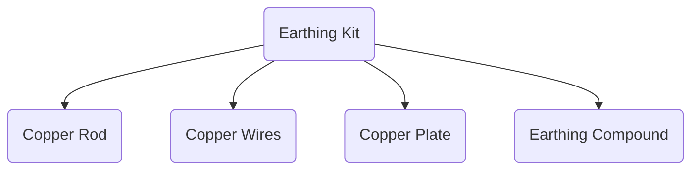

Two separate earthings are required, one for Inverter and another for Lightning Arrester.  

Copper rod of diameter should be enough to conduct lightning to earth and not degrade, or GI can also be taken buried upright in the earth manually or with the help of a pneumatic hammer. 

The following table (Table 8) shows the specifications of the Copper rod:

| Property | Specification |
|---|---|
|Length|6-8 feet|
|Material|Mild Steel|
|Finish |Copper Bonded/Coated|
|Dimension | 24 x 24 inches |

Earthing is required for the protection of human life and protection of equipment of the system from excessive touch voltages; earthing provides the path to neutralize the surge voltage.

The following table shows the benefits of using Earthing compound:

1. Improves soil resistance & the electrical conductivity of the soil
2. Non-toxic & long lasting
3. Excellent Moisture Absorption and Retaining Capacity
4. Enriches the Charge Carrying Ions in the soil

[Back to Table of Contents](#table-of-contents)

## 7.14. Lightning Arrester

Lightning Arrester(LA) protects solar panels from thunder. In dangerous lightning strikes, LA activates and diverts lightning to the ground.

We use a copper bonded lightning arrester of length 1m with an earthing rod for home and building protection. This 1kg and 350gm weight offer coverage of 45° from the top point of the arrester, that is, the surrounding area with a 2m radius.
In order to let the surge current flow to the ground via the earthing system, the copper strip or 4mm copper ac wire is connected between this lightning arrester and the ground earthing system.

Suitable for: 1kW, 2kW, 1kVA to 3kVA off-grid or on-grid solar power system.

The following table (Table 9) shows the specifications of the lightning arrester used:

| Property | Specification |
|---|---|
|Phase| Single Phase|
|No. of Poles| 5|
|Building Protection Coverage|45°C from the top point |
|Application| Residential|
|Material| Copper|
|Surface Treatment| Galvanized |
|Total length|1m |
|Diameter| 9.2mm|
|Dimension of base plate| 9\*9 cm|

## 7.15. Basic tools required

The following flow chart (Fig 13) shows the essential tools required for installing the set-up:

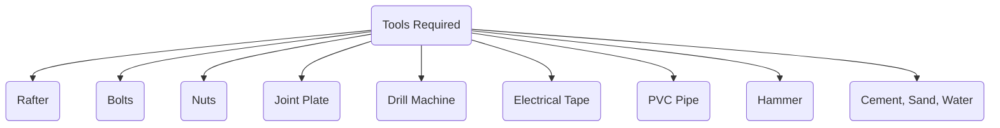

## 7.16. Block Diagram and Wirings

The following figure (Fig 14) shows the block diagram for electricity production and transmission from solar energy:

The amount of energy lost in solar power systems depends on the cable used, solar panel and battery design and how far apart they are. The actual amount of energy lost also depends on the gauge or thickness of the wire. Long, thin cables increase the energy lost as the conductor resists current flow. With a shorter, thicker cable, energy loss is minimized during transmission.[5]

## 7.17. Cost Analysis

Cost analysis(all prices in INR) (Table 10):

|Name |Price (INR) | Quantity | Total Price |
|---|---|---|---|
|Luminous Solar Panel | 14,500 | 6 | 87,000 |
|Charge Controller |55,000|1|55,000|
|DCDB and MC4 connectors|4,765|1|4,765|
|Wires (12 AWG 12 feet)|1,235|4|4,940|
|Wires(6 AWG 1m)|839|2|1,678|
|Lightning arrester Full set |5,531|1|5,531|
|Water heater |26,828|1|26,828|
|Stands |6,500|1|6,500|
|||Total|1,92,242|

[Back to Table of Contents](#table-of-contents)

# 8. Wind Energy

## 8.1. Components of Wind Mill

Fig 15:

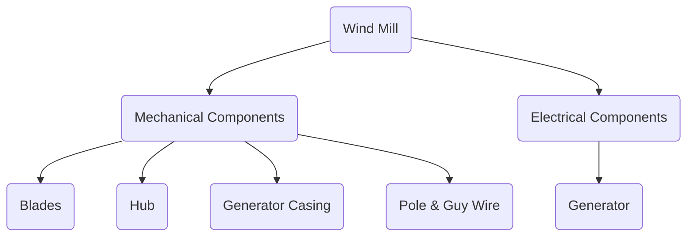

[Back to Table of Contents](#table-of-contents)

## 8.2. Component Description

### 8.2.1. Blade

The following table (Table 11) shows the specifications of the blade used:

| Property | Specification |
| -------- | ------------- |
| Length   | 0.9 m         |
| Material | Carbon fibre  |
| Quantity | 3 pieces      |

We chose this blade because the higher stiffness and lower density of Carbon Fibre allows a thinner blade profile while producing stiffer, lighter blades. These blades have a longer life because carbon fibre materials have high fatigue and corrosion resistance.

Fig 16:
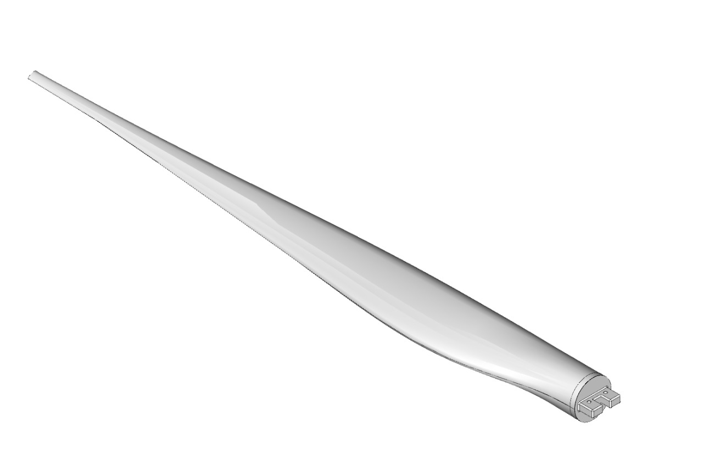

### 8.2.2. Pole + Guy Wires

The following table (Table 12) shows the specifications of the pole used:

| Property              | Specification  |
| --------------------- | -------------- |
| Height                | 27 ft /  8.23m |
| Material              | Aluminium      |
| Maximum load capacity | 150 kg         |

We chose aluminium for the pole because it has a low density and high tensile strength. Aluminium forms a protective oxide layer, making the poles highly corrosion resistant and prolonging their life. The lower weight is not just beneficial during installation; it also offers advantages during shipping and storage that all help to keep the cost down. 

Guy wires provide extra stability during extreme weather conditions.

Fig 17:

### 8.2.3. Hub

The following table (Table 13) shows the specifications of the hub used:

| Property | Specification |
| -------- | ------------- |
| Radius   | 135 mm        |
| Material | Carbon fibre  |

The hub is a crucial component because it holds the blades in their proper position for maximum aerodynamic efficiency; it also rotates the generator's shaft.

Fig 18:
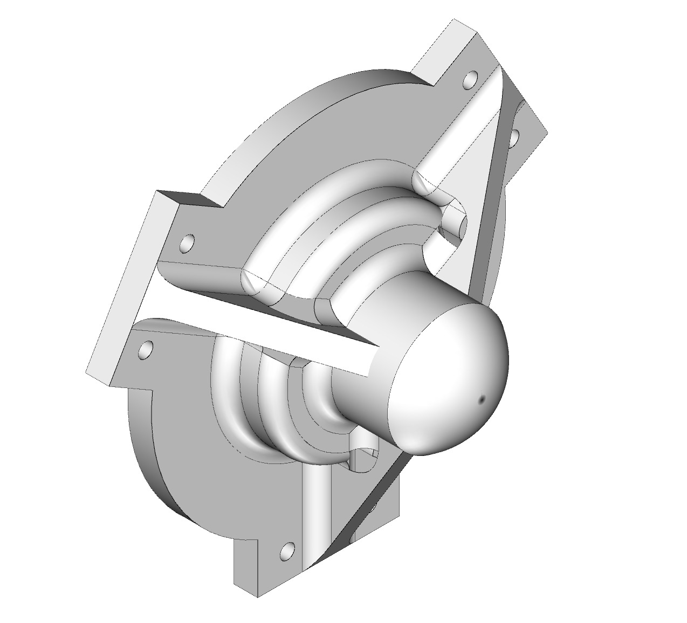

### 8.2.4. Turbine/generator

The following table (Table 14) shows the specifications of the turbine used:

| Property     | Specification                |
| ------------ | ---------------------------- |
| Product Name | CECPL - PMGL 270             |
| Material     | NdFeB (Neodymium Iron Boron) |
| Frequency    | 50Hz                         |
| Efficiency   | 93% (Highly efficient)       |

This generator uses a direct-drive mechanism, which eliminates a gearbox and can operate at variable RPM. A gearbox free mechanism such as ours reduces the weight and cost.

Fig 19:

### 8.2.5. Casing

The following table (Table 15) shows the specifications of the turbine used:

| Property         | Specification            |
| ---------------- | ------------------------ |
| Inner dimensions | 485 mm X 275 mm X 275 mm |
| Thickness        | 10 gauge(2.59 mm)        |
| Material         | 5052 Aluminium H32       |
| Weight           | 4.78 kg                  |

5052 Aluminium is optimal for sheet metal work and is very easy to form at room temperature. This material is very bendable and can therefore handle tight radii.

Fig 20:

### 8.2.6. Assembly

Flowchart of Mechanical Assembly of the Wind Mill(Fig 21):

Working schematics of the Wind Mill (Fig 22):

[Back to Table of Contents](#table-of-contents)

## 8.3. Cost Analysis

The following table (Table 16) shows the cost analysis for Wind Unit:

| Component                              | Quantity | Cost per Unit(INR) |
| -------------------------------------- | -------- | ------------------ |
| Aluminium Casing                        | 1        | 2,500              |
| Permanent Magnet Alternator (PMGL 270) | 1        | 22,000             |
| Guyed Tower (27 ft./8.23m)                   | 1        | 27,442             |
| Carbon Fibre Blades(3) & Hub           | 1        | 6,348              |
| Total                                  |          | 58,290             |

## 8.4. Power Analysis  

Assuming Average Wind Speed to be 4.51 m/s, we get the following results:

1. AC 3-Phase Line-to-Line Voltage Output = 18.8 V
2. Total 3-Phase Power = 440 W
3. Total units generated per month = 278 kWh
4. Cut-off Wind Speed = 1.2 m/s

( The above calculations were done using a tool that we built called Wind-Box. The source code is available [here](https://github.com/STK101/WindEnergy_Toolbox_Tribe-D))
(For formulas used, see Appendix 13.2.)

- Command Line Interface of Wind Box

[Back to Table of Contents](#table-of-contents)

# 9. Biomass Energy

## 9.1. Mindmap

The following diagram shows the mind map used while designing the Biomass energy production unit:

Fig 24:
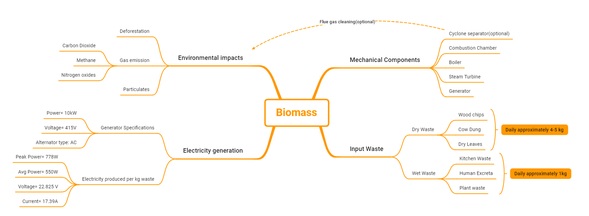

## 9.2. Components of a biomass plant

### 9.2.1. Combustion Chamber

Design and Specifications of the combustion chamber are as follows:

1. The 3 mm thick aluminum (1050a recommended) is used to withstand high combustion temperatures with dimensions of 0.5 m (L) $\times$ 0.5 m (W) $\times$ 2 m (H) and a volume of $\sim0.5$ $m^{3}$.
2. An inlets for fuel can be used like shown in Figure 26 as design would be almost resembling for at least combustion part. The combustion chamber working temperature would be 473 K in controlled oxygen.
3. A hole will be made on the top of the chamber of diameter 100 mm with funnel on top.
4. The combustion chamber will be installed with a steam boiler (refer to boiler design specification), as shown in  Figure 27.
5. For starting, the combustion burner is attached through the inlet of fuel in the combustion chamber and closed once temperature (473 K) is attained.

Taking cost/$m^2$ of 3 mm sheet = INR 7,000

Total cost of making a combustion chamber = INR 30,000(sheet) + INR 5,000(manufacturing cost) =  INR 35,000

Fig 25:
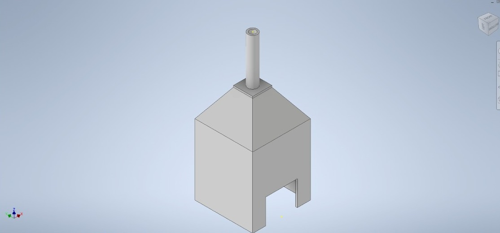

Fig 26[10]:
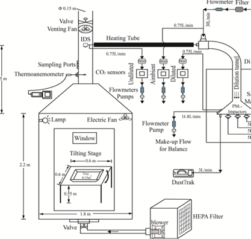

Fig 27:
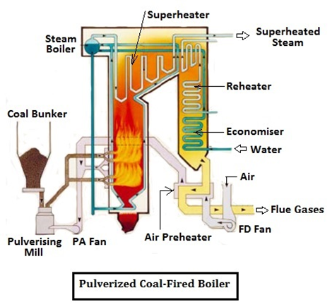

### 9.2.2. High Pressure Boiler

Heated gasses, from the burning fuel, are circulated by natural convection or forced by a pump in a High Pressure Boiler. Boiler processes this water to steam at high pressure. Input is water produced by combustion of 8 kg wood. For 8 kg of wood, the steam produced is 22.58 kg at 70\% efficiency.

The required specifications for the boiler are as follows (Table 18):

| Property |Specifications|
|---|---|
|Length | 1.9 m|
|Diameter of cylindrical base | 1.2 m |
|Area of cylindrical base | 1.13 $m^{2}$ |
|Maximum temperature of water return/supply | 65-80 C |
|Boiler capacity | 80 L of water |
|Cost | INR 45,000 |

Fig 28:
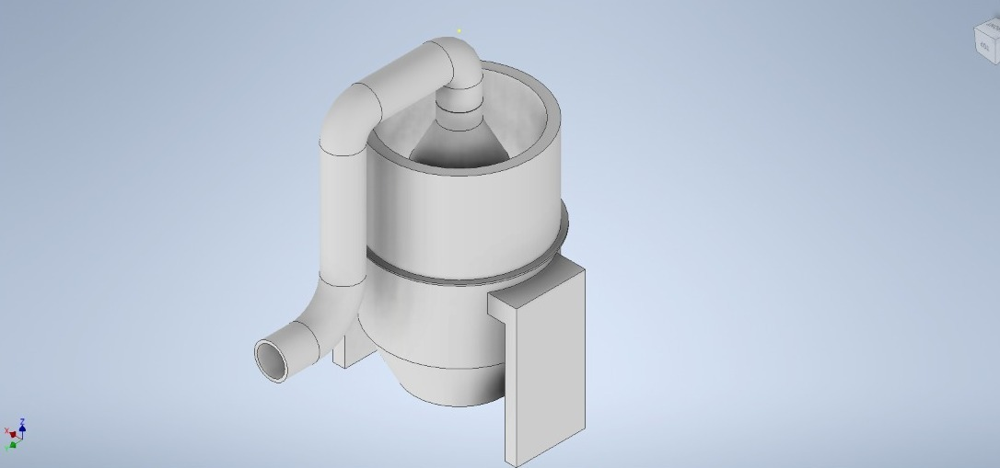

Fig 29:
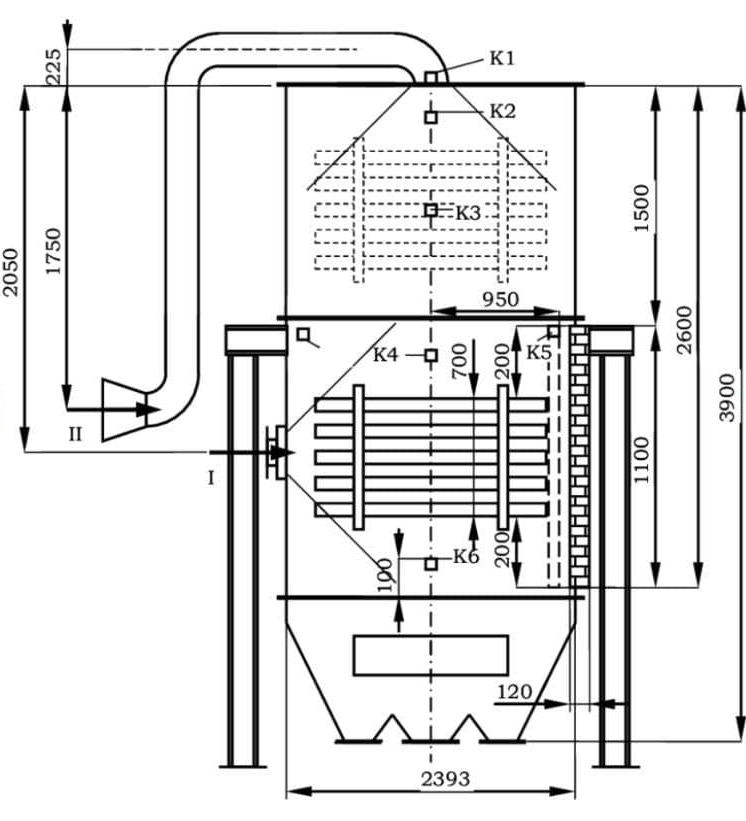

### 9.2.3. Steam Turbine

Steam turbine extracts thermal energy from pressurized steam and uses it to do mechanical work on a rotating output shaft. The turbines are connected to a generator with an axle, which in turn produces energy via a magnetic field that produces an electric current.

The required specifications for the steam turbine are as follows (Table 19):

|Property | Specifications |
|---|---|
|Pressure range | 10 bar- 87 bar |
|Power | 1 kW - 5 MW |
|Power capacity | 1 kW - 40 MW |
|Cost | INR 50,000 |

The required specifications for the generator are as follows(Table 20):

| Property | Specifications|
|---|---|
|Power | 10 kW |
|Voltage | 415 V |
|Alternator type | AC|
|Frequency | 50 Hz, 60 Hz |
|Cost | INR 22000 |

Fig 30:
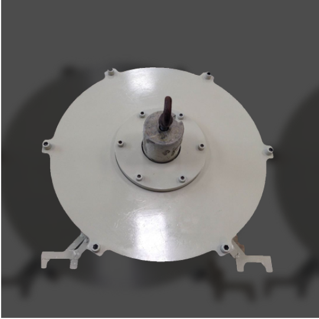

Fig 31:
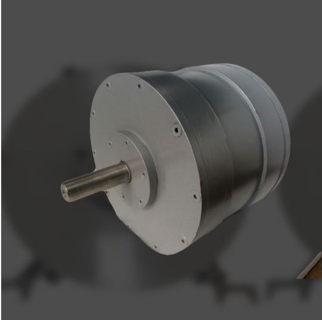

### 9.2.5. Compost Tumbler

The basic requirements for a good compost tumbler are as follows:

1. Having a proper food-web: a mixture of creatures, which include many insects, bugs, slugs, bacteria, and mushrooms, adding a small quantity of soil to this mixture can be used to start the process.
2. Nitrogen/Carbon Ratio : The ideal mix is 3/4  “brown” and 1/4 “green” ingredients by volume which will ensure that the mass maintains the appropriate quantity of humidity and air, and hastens the decomposing process.
3. The compost should remain humid throughout the process. About 50 \% humidity is acceptable. Allow the excess water to drain out through the ventilation bores. The mixture should remain humid, but not wet.
4. All creatures and mushrooms in the compost mixture need oxygen during the process. The tumbler must be rotated every second day or so to prevent cutting off air supply and hastening the process.
5. Location- The fastest decomposition occurs between 140°F (60°C) and 160°F (71°C). We should position the Compost Tumbler out of the excessive wind and in full sunlight.

The following table shows different materials used in compost(Table 21):

|Material | Carbon/Nitrogen |Info|
|---|---|---|
|Fruit and vegetable scraps | Nitrogen | Add with dry carbon items|
|Chicken/rabbit manure | Nitrogen | Excellent compost 'activator', use in moderation |
| Coffee grounds | Nitrogen| Filters may also be included |
|Tea leaves | Nitrogen | Loose or in bags |
|Grass clippings| Nitrogen | Add in thin layers so they don't mat into clumps and putrefy |
|Garden plants |Nitrogen |Use disease-free plants only|
|Lawn & garden weeds | Nitrogen | Only use weeds which have not gone to seed |
|Flowers, cuttings | Nitrogen | Chop up any long woody stems |
|Seaweed and kelp | Nitrogen | Rinse first; good source for trace minerals |
|Eggshells | Neutral | Best when crushed |
|Leaves  | Carbon | Leaves break down faster when shredded |
|Straw or hay | Carbon| Straw is best; hay (with seeds) is less ideal |
|Pine needles| Carbon | Acidic; use in moderate amounts |
|Wood ash | Carbon | Only use ash from clean materials; sprinkle lightly  |
|Cardboard | Carbon  | Shred material to avoid matting |
|Corn cobs, stalks | Carbon | Slow to decompose; best if chopped up |
|Dryer lint | Carbon | Best if from natural fibers |
|Wood chips | Carbon | High carbon content can overwhelm, and shut down, an otherwise good compost batch; use sparingly|
|Sawdust| Carbon | High carbon content can overwhelm, and shut down, an otherwise good compost batch; use sparingly. Be sure sawdust is clean, with no machine oil or chain oil residues from cutting equipment. Do not use sawdust from painted or treated lumber  |

The following items should be avoided in compost:

1. Meat, fish, fats, bones and other foods like dairy products, sauces, salad dressing, and cooking oil as these could ferment or putrefy, causing odors, and attracting flies, rodents, or other animals that can be pests
2. Ashes but could be used in small quantities
3. Dog and cat feces may cause a risk of adding diseases
4. Perpetual weeds that have turned to seed or diseased plants are not to be used as they can spread with the compost
5. Any cooked or canned foods that contain salt as salt kills the little creatures that do the composting in your mixture

Materials required for making a Compost Tumbler are as follows:

1. 55-gallon plastic drum of length 39 inches, diameter 25 inches and thickness- 3/16  inches
2. Two pressure-treated wooden boards of dimensions 4 ft x 8 ft and one of dimensions 6 ft x 8 ft
3. Six HDPE plastic sheets of dimension 0.5 inches $\times$ 0.5 inches each
4. Stainless steel butt hinges
5. Stainless steel latch
6. A galvanized metal Axle of diameter 0.5 inches and length 42 inches

Fig 32[11][13]:
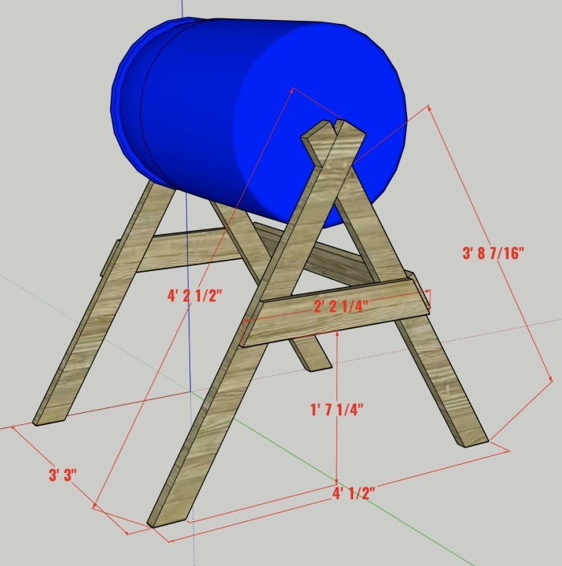

Design specifications for the Compost Tumbler are as follows:

1. Tumbler’s Hatch Door- 12 inches x 12 inches, attached with a hinge and locked with a latch.
2. Drill holes in the drum to allow airflow in and out. Sufficient airflow is important to allow rain and air to enter and drain out of the drum. Space them 2-3 inches apart. Holes can be of 3/8 inches diameter.
3. We add 1/2 inches square HDPE plastic inside the drum, to prevent the compost from stelling at the base.

Our compost tumbler can process around 200 L of waster at one time. A properly combined mixture will reach a working temperature of about 140° F (60° C) in about five days. At this time, the mixture will be settling. The compost is ready when the original ingredients have turned into a uniform, dark brown, crumbly product with a pleasant, earthy aroma.

Cost Estimations for the Compost Tumbler:

The major parts required are a pressure-treated wooden board, a 55-gallon plastic drum, and a 0.5 inches $\times$ 0.5 inches HDPE plastic sheet. Other than those we would need screws, hinges, and a latch.

1. Drum- INR 600 to INR 800
2. Pressure treated wooden boards- INR 300
3. HDPE Plastic sheet- INR 100

So the total cost would be INR 1200 to INR 1500.

### 9.2.6. Flue Gas Cleaning

Flue gas is the gas that emanates from combustion plants and which contains the reaction products of fuel and combustion air and residual substances such as particulate matter (dust), sulfur oxides, nitrogen oxides, etc, that are hazardous to the environment and health. The purpose of a flue gas cleaning system is to reduce atmospheric emissions of these substances.

Many gas cleaning systems can be summarized as removal of particulates, removal of water soluble gas and pollutants, removal of NO$_{x}$ and removal of toxic and hazardous pollutants like mercury (Hg).

Fig 33:
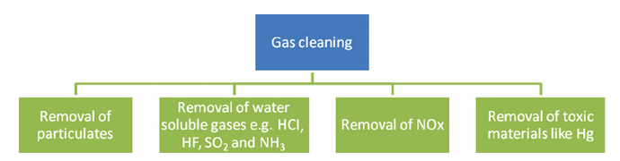

### 9.2.7. Cyclones (Cyclone separator)

1. In cyclones, particles are separated by centrifugal forces. Flue gas containing particulates is fed into a cylinder tangentially in order to achieve rotational movement. The inside of the chamber creates a spiral vortex, similar to a tornado.[9]
2. The lighter components of this gas have less inertia, so it is easier for them to be influenced by the vortex and travel up it.
3. Contrarily, larger components of particulate matter have more inertia and are not as easily influenced by the vortex  and drop down into a collection hopper.
4. The cleaned flue gas escapes out the top of the chamber.
5. Estimated Cost : 1.2-1.5 m (4-5 ft) tall cyclone separator can cost about INR 75000.
6. Efficiency : 70-80\% for particulate matter

Fig 34:
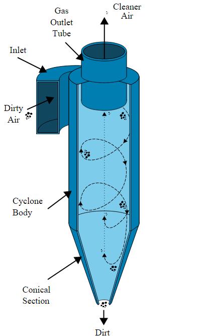

## 9.3 Cost Analysis

The folllowing table (Table 22) shows cost analsis for Biomass Unit:

|Components | Price (INR)|
|---|---|
|Combustion chamber | 35000 |
|High Pressure boiler | 45000 |
|Steam turbine | 50000 |
|Generator | 22000 |
|Cyclone separator| 75000|
|Fuel for combustion chamber and boiler | 10000 |
|Compost tumbler | 1500|

## 9.4 Results for Biomass Production

The total cost would be INR 1,68,500.

Total electricity produced is 550 W per kg waste

[Back to Table of Contents](#table-of-contents)

# 10. Storage

The following figure (Fig 35) shows the Mindmap used while developing the storage unit:

## 10.1. Requirements

The following are the requirements of storage of energy produced by the Solar, Wind and Biomass sources:

1. The battery must be durable and resistant to temperature, pressure, and interference changes. Along with being durable, it should be space-efficient and flexible to changing loads

2. Capacity should be enough to generate electricity to power up the entire house

3. Connecting wires should be robust and long-lasting

4. Depth of discharge, an indicator of the percentage of the battery capacity that can be used before potentially shortening its life span, should be high to increase the usage

5. There must be an I/O device that shows the amount of energy stored in the electrical storage devices

6. Set-up and Maintenance costs should be kept in mind

7. Provisions for DC/AC conversion using an inverter and DC/DC conversion

8. The working system must require minimal supervision, including protective coverings, automated systems, and a single point of contact for all the user interfaces

9. Circuit breakers must be added to handle the excessive load. There must be a system to efficiently store distinct types of energy (AC/DC) from various sources without interference

10. There must be a system to efficiently store distinct types of energy(AC/DC) from various sources without interference

11. Provisions to cut-off storage and sell off surplus energy

12. Peer-to-peer energy sharing mechanism (off-grid communities)

13. Round-trip efficiency, which signifies the fraction of energy put into the storage that can be retrieved, should be high

14. Coolants must be added

## 10.2. Specifications

1. One 85A Charge Controller with the following specifications:
   1. 85A - As per the given maximum current allowed
   2. Power combiner box to monitor high-voltage fuses and over-voltage and provide protection against over-current
   3. Charging management algorithm

2. 3500W 24V-240V Inverter

The following table (Table 23) shows the specifications of the Inverter used :

| Property            | Specification                                 |
| ------------------- | --------------------------------------------- |
| Input Voltage       | 24V DC                                        |
| Item                | Quantity                                      |
| Output Voltage      | 240V AC                                       |
| Frequency           | 50Hz/ 60Hz±5% (Auto)                          |
| Waveform            | Pure Sine Wave                                |
| Power Load factor   | <=0.8                                         |
| Transfer efficiency | >=85%(Full Load)                              |
| Overload capacity   | 105-120% at 30s; 120-150% at 10s; >150% at 5s |
| Low voltage         | DC 10.5 (12V)/ DC 21 (24V)                    |
| High temperature    | 85℃, Auto shut down after alarm               |
| Short-circuit       | Automatic shut-down                           |
| Over Voltage        | DC 17V (12V)/ DC 33V (24V)                    |

The inverter also has the following features:

1. Auto restart while AC is recovering
2. Inverter PC connection to display the power left
3. Air cooling of inverter

3. Supplied Power:

The following table (Table 24) shows the characteristics of Supplied Power:

| Property                    | Specification |
| --------------------------- | ------------- |
| Base consumption            | 1.3kW         |
| Peak Output Power to Supply | 7.5kW         |
| Max. Peak load Duration     | 1 hour           |

4. Battery:

The following table (Table 25) shows the specifications of the Battery:

| Property                                 | Specification                    |
| ---------------------------------------- | -------------------------------- |
| Nominal (average) battery output voltage | 24V DC                           |
| Max continuous charge current            | 85A                              |
| Total capacity                           | 9.6 * safety factor(1.5)         |
| Cell Cathode Material                    | LiFePO4 (Lithium Iron Phosphate) |
| Cycle Life                               | 2000-3000                        |
| Operating Temperature                    | 5°C - 45°C                       |

[Back to Table of Contents](#table-of-contents)

## 10.3. Design

### 10.3.1 Charge Controller

For an optimal charging operation, the current and voltage supplied to the battery must follow specific characteristics depending on the battery to ensure its longevity. Circuits called charge controllers can prevent overcharging and protect the battery from over-voltage.

A charge controller either uses PWM or MPPT to control the battery supply.

1. PWM based control: Switch between the controller and the battery. A PWM-based control is more suitable for smaller systems where the efficiency is not critical

2. MPPT based control: Adjusts the load on the supply dynamically with an incentive to maximize the power drawn from the supply. A charge controller equipped with MPPT dramatically improves the efficiency at which energy is stored. This form of control is more suitable for our use case as the energy stored is vital

Remark: The output voltage of the supply needs to be close to the charging voltage of the battery, but using a battery of such a charging voltage was not feasible from a cost perspective

1. Solar Charge Controller

The following table shows the specifications of the Solar Charge Controller[14]:

| Property                 | Specification |
| ------------------------ | ------------- |
| Charging Voltage         | 24V           |
| Charging Current Allowed | 80A           |
| Allowed Charging Power   | 6000W         |
| Uses MPPT                |
| Dimension                | 394×240×134mm |
| Weight                   |               |
| Cost                     |               |

2. Wind Turbine Charge Controller

The following table (Table 26) shows the specifications of the Wind Turbine Charge Controller[15]:

| Property         | Specification |
| ---------------- | ------------- |
| Charging Voltage | 24V           |
| Charging Power   | 600W          |
| Uses MPPT        |
| Dimension        | 100×80×15mm   |
| Weight           | 0.4 kg        |
| Cost             | $104.61       |

Fig 36:

3. Biomass turbine Charge controller

The following table (Table 27) shows the specifications of the Biomass Turbine Charge Controller[16]:

| Property         | Specification |
| ---------------- | ------------- |
| Charging Voltage | 24V           |
| Charging Power   | 800W          |
| Uses MPPT        |
| Dimension        | 100×80×15mm   |
| Weight           | 0.4 kg        |
| Cost             | 7500 (INR)     |

Fig 37:

### 10.3.2 Battery

The battery bank stores energy produced by the three power sources.

It receives a DC input of 24V from the charge controllers and gives a DC output at 24V to the inverter.

There are two types of batteries available in the market:

1. Lithium-Ion batteries

2. Lead Acid batteries

For our domestic storage requirements, a lead-acid battery is a more suitable and cost-effective option than Lithium-ion-polymer batteries.

The battery bank comprises six lead-acid batteries, such as sets of 2 batteries connected in series, and three such sets are connected in parallel.

Two batteries connected in series ensure a 24V (2 $*$ 12V) bank capacity.

Three parallel sets can handle 132A (3 $*$ 44A) charging current and ensure a 660Ah (3 $*$ 220Ah) and hence 15.84 KW bank capacity.

**Selected battery:**

**ILTT26060, Lead Acid Storage Battery (Factory Charged)**

The following table (Table 28) shows the characteristics of the ILTT26060 Battery

| Property                          | Specification              |
| --------------------------------- | -------------------------- |
| Capacity                          | 220Ah                      |
| Output Voltage                    | 12V                        |
| Dimensions                        | 50.2 x 19.1 x 44 cm        |
| Weight: Filled weight             | (±5% Kg)->64kg             |
| Number of batteries in the bank   | 6                          |
| No. of parallel sets              | 3                          |
| No. of series-connected batteries | 2                          |
| Total power                       | (12)V*(6*220) Ah = 15.84kw |
| Total Cost                        | 6*20,856 = 1,25,136 INR    |

Fig 38:

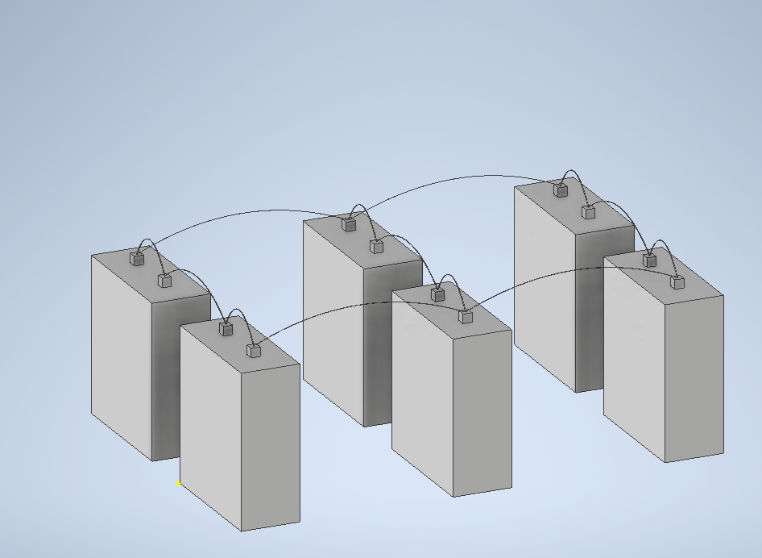

1 N Battery, 6 N Float Indicator, 1 N Warranty Card, 2N MS fasteners.

220 Ah capacity, 12V.

Warranty 60 Months.

Tall tubular battery with good charge acceptance and long backup.

30% more acid volume per ampere hour than ordinary tubular batteries.

It has high purity, corrosion-resistant proprietary spine alloy composition for extended battery life.

Extra-strong, flexible oxidation-resistant gauntlet for better performance and durability.

Puncture-resistant polyethene separators minimize the possibility of internal short circuits.

High durability with sealed plastic housing.

Suitable for areas with long and frequent power cuts.

Easy maintenance with level indicators.

### 10.3.3 Inverter (For converting DC to AC)

The battery provides a DC, but the household appliances and the electrical grid of a household require an AC. Therefore, the DC needs to be converted into AC using an inverter device.

[Back to Table of Contents](#table-of-contents)

#### Design of a simple inverter:-

Many inverters are available in the market, depending on the output frequency requirement (50Hz for us) and input voltage requirement:

1. 12 V DC - for smaller consumer and commercial inverters typically run from a rechargeable 12 V lead-acid battery or automotive electrical outlet

2. 24, 36 and 48 V DC - common standards for home energy systems

3. 200 to 400 V DC - when power is from photovoltaic solar panels

4. 300 to 450 V DC - when power is from electric vehicle battery packs in vehicle-to-grid systems

5. 1000 V - when the inverter is part of a high voltage direct current power transmission system

Fig 39:

We will need the input to be 24V (coming from the battery) for our purposes with the following specifications (Table 29)[17]:

| Property               | Specification                       |
| ---------------------- | ----------------------------------- |
| Input                  | 24V DC Current from battery         |
| Output                 | 220V AC current with Frequency 50Hz |
| Efficiency             | 95% to 98%                          |
| Minimum Inverter Power | 1000W                               |
| Price                  |1200 (INR)                  |
| Dimensions of Inverter | 8cm $*$ 9cm $*$ 6cm                 |

[Back to Table of Contents](#table-of-contents)

## Cost Analysis

The following table (Table 29) shows the cost analysis for storage unit:

| Item                           | Quantity | Price/item(INR) | Total  |
| ------------------------------ | -------- | ----------------- | ------ |
| MCB 100A                       | 1        | 1700              | 1700   |
| MCB 20A                        | 2        | 100               | 200    |
| Inverter                       | 1        | 1200              | 1200   |
| Battery                        | 6        | 20856             | 125136 |
| Wire 100A                      | 20ft     | 1000              | 20000  |
| Wind Turbine charge controller | 1        | 7500              | 7500   |
| Biomass charge controller      | 1        | 8000              | 8000   |

[Back to Table of Contents](#table-of-contents)

# 11. Closure

[Back to Table of Contents](#table-of-contents)

# 12. Appendix

## Appendix A: Rating Calculations for Solar Charge Controller

Rating of Solar Charge Controller: 85A,150V
Maximum charging current for batteries = ( Solar panel Wattage / System voltage ) = (6*335/24) = 83.75A (<85A)

The maximum rated voltage of the charge controller is 100V. The short circuit Voltage rating of each solar panel is 46.5V, and the total maximum voltage from a combination of panels is 46.5x2=93V(<150V)

## Appendix B: Wind energy density distribution over India

Fig 40:

## Appendix C: Power Calculations

Formulas used[19]:

- $\omega \leq \frac{V \ × \ TSR }{ π \ \times \ D }$
- $P_{wind} = (1/2) \times ρ × (πr^2)\times v^3 \times C_p$
- $P_{load} = \tau ×ω$
- $P_{load} \leq P_{wind}$
- $P_{load} = 10.5 \times 60 \times \omega = 630 \omega$
- $τ \geq 0.136 \times P_{load} \ \ or \ \ 86.1 \times ω \ \ \ \ ∀ \ \ \ P_{load} \leq 1170w \ \ or \ \ ω \leq 1.85hz$
- $τ \leq P_{wind} \ / \ \omega$

For $\tau$ to exist :   $P_{wind} \ / \ ω \geq 86.1 \times ω$

Hence, $0 \leq ω \leq (P_{wind}/86.1)^{1/2}$
  
Abbreviations in the above-used formulas are given in the following table:

| Abbreviation      | Meaning                            |
| ----------------- | ---------------------------------- |
| $\tau$            | Torque generated by the wind       |
| $P_{\text{wind}}$ | Power of flowing air(wind)         |
| $P_{\text{load}}$ | Power input to generator           |
| TSR               | Tip Speed Ratio(Inherent property) |
| $\omega$          | angular velocity of turbine        |
| $v$               | Velocity of wind                   |
| $C_p$             | Power Coefficient                  |

Now, we have three upper limits of omega, and our system will run on the largest of these three, and accordingly, we will get $P_{load}$ as given.

- Reliable Data for wind speeds was available at 50 meters above ground level. Our windmill is 10 meters above ground; we can use the formula below to approximate wind speed at that height.

$v_{10} = v_w(h) \cdot \left( \frac{h_{10}}{h} \right)^a$

From this, we get $4.51$ m/s as stated above.

Output power @Wind Speed(4.5 m/s) ~ 470 Watts

[Back to Table of Contents](#table-of-contents)

# 13. References
1. “ACDB DCDB: Best price for ACDB DCDB box in India - Kenbrook Solar.” 
https://kenbrooksolar.com/price-list/acdb-dcdb-array-junction-box-manufacturer (accessed Jan. 11, 2022).

2. “Blacktail Solar Homes: Discussion of why we experience seasonal solar variation, and how this variation affects home design.” 
https://www.blacktailsolarhomes.com/EarthWobble.html (accessed Jan. 11, 2022).

3. “fcto_fuel_cells_fact_sheet.pdf.” Accessed: Jan. 11, 2022. [Online]. 
Available: https://www.energy.gov/sites/prod/files/2015/11/f27/fcto_fuel_cells_fact_sheet.pdf

4. mdavis19, “How I Built an Electricity Producing Wind Turbine,” Instructables. 
https://www.instructables.com/How-I-built-an-electricity-producing-wind-turbine/ (accessed Jan. 11, 2022).

5. “How much does Solar Panel Installation Cost in India, 2022.” 
https://www.loomsolar.com/blogs/collections/solar-panel-installation-cost-in-india (accessed Jan. 11, 2022).

6. “How to Build a Fuel Cell.” 
https://www.fuelcellstore.com/blog-section/how-to-build-a-fuel-cell (accessed Jan. 11, 2022).

7. “Installing and Maintaining a Small Wind Electric System | Department of Energy.” 
https://www.energy.gov/energysaver/installing-and-maintaining-small-wind-electric-system (accessed Jan. 11, 2022).
 
8. ———. “Panasonic Launches 5 kW Type Pure Hydrogen Fuel Cell Generator | Headquarters News | Panasonic Newsroom Global.” 
https://news.panasonic.com/global/press/data/2021/10/en211001-4/en211001-4.html (accessed Jan. 11, 2022).

9. T. Kamoshita and N. Nakajima, “Present Status and Trends of Fuel Cell Power Generation,” vol. 47, no. 1, p. 6.

10. “SHARK Bi-facial Panel, 440- 530 Watt, Both side power generation panel.” 
https://www.loomsolar.com/collections/solar-panels/products/shark-bifacial-front-back-power-generation-solar-panel (accessed Jan. 11, 2022).

11. ———. “Solar Pump, Solar Pump Manufacturer in India, submersible Solar Pump | Lubi Solar.” 
https://www.lubisolar.com/solar-pumps/ (accessed Jan. 11, 2022).

12.  Andrianto, M, and Fahriansyah Fahriansyah. 2019. “3-D Designing of an Organic Waste Crusher.” IOP Conference
Series: Earth and Environmental Science 277 (June): 012009.
https://doi.org/10.1088/1755-1315/277/1/012009

13.  “(PDF) Design and Fabrication of Multipurpose Organic Chopper Machine.” n.d. Accessed January 25, 2022.
https://www.researchgate.net/publication/338718623_Design_and_fabrication_of_multipurpose_organic_chopper_machine

14. ———.  “Amazon.Com: EPEVER Mppt Solar Charge Controller 80a 12v/24v/36v/48v Auto Max 200V 6000W Inpot Power Fit for Sealed/Gel/Flooded(Tracer 8420AN): Patio, Lawn Garden.” n.d. Accessed January 25, 2022. 
https://www.amazon.com/EPEVER-Charge-Controller-Sealed-Flooded/dp/B07JJBRGN8

15. “600W Wind Turbine MPPT Charge Controller, 12V/24V.” n.d. ATO.Com. Accessed January 25, 2022.
https://www.ato.com/600w-wind-turbine-mppt-charge-controller

16. “800W Wind Turbine MPPT Charge Controller, 12V/24.” n.d. Inverter.Com. Accessed January 25, 2022.
https://www.inverter.com/800w-wind-turbine-mppt-charge-controller

17.  “Battery 220 Ah - ILTT26060.” n.d. Accessed January 25, 2022.
https://www.luminousindia.com/iltt-26060.html

18.  “Tubular Battery Price in India - ILTT 26060 — Luminous India.” n.d. Accessed January 25, 2022.
https://www.luminousindia.com/iltt-26060.html

19. "Wind Turbulence." 
https://encrypted-tbn0.gstatic.com/images?q=tbn:ANd9GcSOfCjI23bKthOS6BOLnA0CwXqZfi8DuEJBrw&usqp=CAU (accessed Jan. 11, 2022).
